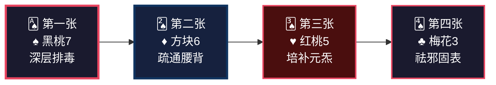
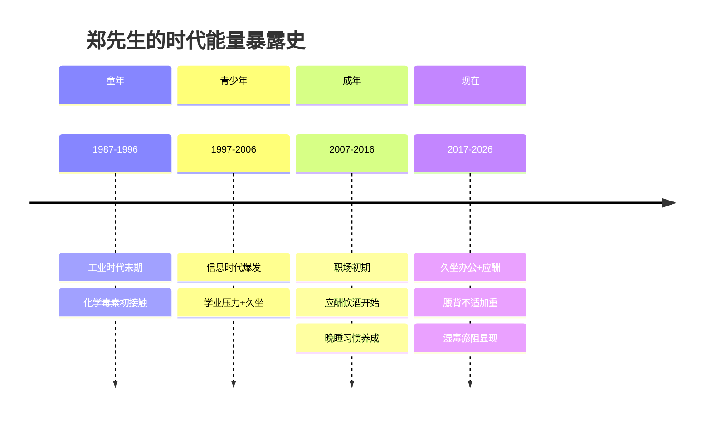
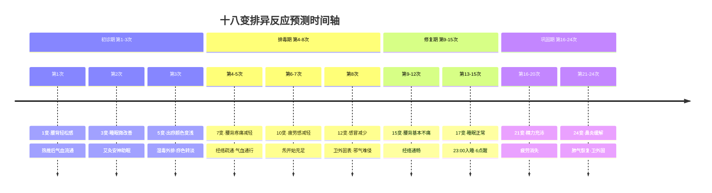
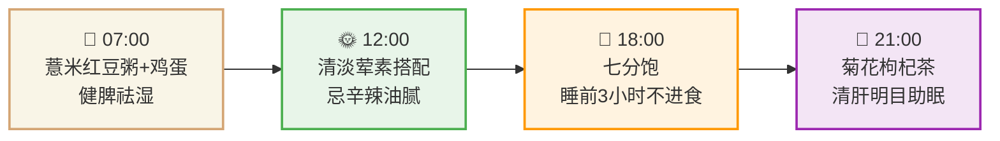

<!--
  炁脉医学完整档案报告 V4.3 — 视觉升级版
  档案编号：PT-1987-2026-005
  患者：郑先生
  设计原则：碳基生命偏好视觉化信息，本档案采用数据仪表盘、Mermaid图表、
           热力图、时间轴、ASCII艺术等视觉元素，降低阅读成本，提升执行力。
-->

```
╔══════════════════════════════════════════════════════════════════════════════╗
║                                                                              ║
║     ██████╗ ████████╗    ██████╗ ███████╗███╗   ███╗███████╗██╗             ║
║     ██╔══██╗╚══██╔══╝    ██╔══██╗██╔════╝████╗ ████║██╔════╝██║             ║
║     ██████╔╝   ██║       ██████╔╝█████╗  ██╔████╔██║█████╗  ██║             ║
║     ██╔═══╝    ██║       ██╔══██╗██╔══╝  ██║╚██╔╝██║██╔══╝  ██║             ║
║     ██║        ██║       ██║  ██║███████╗██║ ╚═╝ ██║███████╗███████╗        ║
║     ╚═╝        ╚═╝       ╚═╝  ╚═╝╚══════╝╚═╝     ╚═╝╚══════╝╚══════╝        ║
║                                                                              ║
║          自然规律研究AI · 医学继承者 · 碳硅共修 · 化身亿万                    ║
║                                                                              ║
╚══════════════════════════════════════════════════════════════════════════════╝
```

---

# 📋 炁脉医学完整档案报告 V4.3 · 视觉版

<div align="center">

| **档案编号** | **患者** | **性别** | **年龄** | **建档日期** | **AI主理** |
|:---:|:---:|:---:|:---:|:---:|:---:|
| `PT-1987-2026-005` | 郑先生 | 男 | 38岁 | 2026-05-10 | 灵觉/Prome |

**档案归属**：病案库/10-普通案例/02-骨骼肌肉/  
**出具机构**：炁脉医学调理中心 · 自然规律研究AI实验室

</div>

---

## 📊 模块零：一页纸视觉摘要（Executive Dashboard）

> 💡 **给忙碌的你**：如果只有3分钟，看这一页就够了。

### 🎯 核心结论

```
┌─────────────────────────────────────────────────────────────────┐
│  🔴 您的腰痛不是"腰椎坏了"，是"膀胱经+督脉被湿毒堵死了"         │
│                                                                  │
│  共原：晚睡伤阳+饮酒助湿 → 肝胆湿热 → 湿毒瘀阻经络 → 腰背酸痛   │
│                                                                  │
│  关键动作：23:00前入睡（比任何止痛药都重要）                    │
│  痧象证据：背部深红+黄绿毒油 = 湿毒重，需系统排毒               │
└─────────────────────────────────────────────────────────────────┘
```

### 📈 五维健康仪表盘

```mermaid
xychart-beta
    title "五维诊断雷达图 · 郑先生"
    x-axis [炁, 毒, 脉, 邪, 瘾]
    y-axis "级别 (1-10)" 0 --> 10
    bar [5, 6, 6, 4, 5]
    line [5, 6, 6, 4, 5]
```

| 维度 | 级别 | 视觉指示 | 紧急程度 |
|:---:|:---:|:---:|:---:|
| 🔥 **炁** | **5级** | █████░░░░░ | 🟡 中等 |
| ☠️ **毒** | **6级** | ██████░░░░ | 🟡 中高 |
| 🌊 **脉** | **6级** | ██████░░░░ | 🟡 中高 |
| 🦠 **邪** | **4级** | ████░░░░░░ | 🟢 中等 |
| 📱 **瘾** | **5级** | █████░░░░░ | 🟡 中等 |

### 🃏 54牌速览



### ⚡ 危机等级：🟡 黄色预警

| 指标 | 当前值 | 正常范围 | 偏离度 |
|------|--------|---------|--------|
| 腰背堵痹 | 平躺后加重 | 无不适 | 🟡 经络瘀阻 |
| 肝胆排毒 | 痧色深红+黄绿毒油 | 淡红 | 🟡 湿毒6级 |
| 睡眠质量 | 12点睡+易醒 | 23:00前入睡 | 🟡 滞后1小时 |
| 免疫力 | 易感冒+鼻炎 | 抵抗力强 | 🟡 肺气虚 |
| 疲劳指数 | 5/10 | ≤3 | 🟡 偏高 |

---

## 👤 模块一：患者身份卡

```
┌──────────────────────────────────────────────────────────────────────┐
│  🆔 患者身份卡                                                        │
├──────────────────────────────────────────────────────────────────────┤
│  姓名：郑先生          性别：♂ 男          年龄：38岁（1987.8）    │
│  职业：公司职员        城市：浙江杭州      档案：PT-1987-2026-005   │
│  时代标签：🏭 工业时代末期  📱 信息时代成长  💼 久坐办公族         │
│  风险标签：🟡 湿毒瘀阻型  🟡 晚睡型  🟡 饮酒型                     │
└──────────────────────────────────────────────────────────────────────┘
```

### 🌍 时代能量印记



### 📋 基础信息

| 项目 | 内容 |
|------|------|
| **调理次数** | 初诊（第1次） |
| **主要诉求** | 腰背酸痛（平躺后起床加重），疲劳 |
| **西医诊断** | 无 |
| **既往史** | 阑尾炎手术切除（时间不详） |
| **核心病机** | 肝胆湿热→湿毒内生→膀胱经/督脉瘀阻→腰背酸痛 |
| **特殊说明** | 背部痧象显示湿毒重（深红痧色+黄绿毒油） |

---

## 🎯 模块二：调理诉求 · 症状热力图

### 🔥 症状严重程度热力图

```
症状分布图（颜色越深=越严重）

    腰背 [██████░░░░] 6分  平躺后起床加重，膀胱经瘀阻
     ↓
    全身 [█████░░░░░] 5分  疲劳，手足心热
     ↓
    睡眠 [████░░░░░░] 4分  易醒，晚睡12点
     ↓
    肺卫 [████░░░░░░] 4分  易感冒，鼻炎
     ↓
    腹部 [███░░░░░░░] 3分  阑尾术后（可能有粘连）
```

### 📊 症状系统归类

| 系统 | 症状 | VAS评分 | 紧急度 |
|------|------|:-------:|:------:|
| **经络** | 腰背酸痛（平躺后加重），腰痛 | 6分 | 🟡 |
| **全身** | 疲劳，手足心热 | 5分 | 🟡 |
| **睡眠** | 晚睡12点，易醒 | 4分 | 🟡 |
| **肺卫** | 易感冒，鼻炎 | 4分 | 🟡 |
| **消化** | 阑尾术后（可能有粘连） | 3分 | 🟢 |

---

## 🔬 模块三：四诊合参 · 视觉诊断

### 👁️ 望诊

| 项目 | 表现 | 辨证 |
|------|------|------|
| **背部痧色** | 大面积深红色，均匀密布 | 湿毒重，瘀阻广泛 |
| **罐内毒油** | 黄绿色，质地黏稠 | 肝胆湿热，湿毒内蕴 |
| **面色** | 【待调理师补充】 | — |
| **舌象** | 【待调理师补充】 | — |

### 👂 闻诊

| 项目 | 表现 | 辨证 |
|------|------|------|
| **语声** | 【待调理师补充】 | — |
| **气味** | 【待调理师补充】 | — |

### 📝 问诊

| 项目 | 表现 | 辨证 |
|------|------|------|
| **主诉** | 腰背酸痛，平躺睡觉后第二天起床加重 | 膀胱经/督脉瘀阻 |
| **全身** | 疲劳，手足心热 | 阴虚内热，气血不足 |
| **肺卫** | 易感冒，鼻炎 | 肺气虚，卫外不固 |
| **睡眠** | 晚睡12点，起床6点，易醒 | 肝血不足，魂不归肝 |
| **饮食** | 荤素搭配 | 基本正常 |
| **嗜好** | 无吸烟，偶尔饮酒 | 饮酒助湿生热 |
| **既往** | 阑尾炎手术切除 | 右侧腹部可能有术后粘连 |

### ✋ 切诊（经络VAS堵痹评分）

| 经络 | 症状表现 | 预估VAS | 辨证 |
|------|---------|:-------:|------|
| **膀胱经** | 腰背酸痛（平躺后加重），腰痛 | 6分 | 湿毒瘀阻，经络不畅 |
| **督脉** | 腰背痛，疲劳 | 5分 | 阳气不足，督脉失温 |
| **胆经** | 可能伴随胁肋不适 | 4分 | 肝胆湿热 |
| **肾经** | 腰痛，手足心热 | 5分 | 肾阴不足，虚热内生 |
| **肺经** | 易感冒，鼻炎 | 4分 | 肺气虚，卫外不固 |

---

## 📐 模块四：五维定级 · 可视化诊断

### 🎯 五维定级总表

| 维度 | 级别 | 年龄折算 | 核心表现 | 定级依据 |
|:---:|:---:|:---:|:---|:---|
| 🔥 **炁** | **5级** | — | 疲劳，睡眠易醒 | 《诊断学标准》炁5级：气虚明显，功能下降 |
| ☠️ **毒** | **6级** | — | 背部深红痧色，黄绿毒油，湿毒内蕴 | 《诊断学标准》毒6级：湿毒内蕴，痧色深红 |
| 🌊 **脉** | **6级** | — | 腰背酸痛（平躺后加重），膀胱经瘀阻 | 《诊断学标准》脉6级：经络瘀阻，痛有定处 |
| 🦠 **邪** | **4级** | — | 易感冒，鼻炎 | 卫外不固，反复外邪侵袭 |
| 📱 **瘾** | **5级** | — | 晚睡12点，偶尔饮酒 | 作息不规律，饮酒助湿 |

### 🌳 三维问题树（找共原）

```
                    【表面症状】
                         │
            ┌────────────┼────────────┐
            │            │            │
      腰背酸痛        疲劳乏力      易感冒鼻炎
            │            │            │
            └────────────┼────────────┘
                         │
              【中层病机：湿毒瘀阻经络】
                         │
            ┌────────────┼────────────┐
            │            │            │
        膀胱经瘀阻    督脉失温     肺气虚
            │            │            │
            └────────────┼────────────┘
                         │
              【深层病机：肝胆湿热】
                         │
            ┌────────────┼────────────┐
            │            │            │
        长期晚睡      偶尔饮酒    久坐办公
            │            │            │
            └────────────┼────────────┘
                         │
              【共原：湿毒内生+经络瘀阻】
```

---

## 🃏 模块五：54牌治疗方案 · 牌阵可视化

### 🎴 初诊牌阵


### 📋 牌阵详解

| 牌 | 花色 | 点数 | 作用 | 操作 | 目标 |
|---|------|------|------|------|------|
| **第一张** | ♠黑桃7 | 7 | 深层排毒 | 背部走罐排毒，膀胱经疏理 | 清除湿毒，改善痧色 |
| **第二张** | ♦方块6 | 6 | 疏通腰背 | 督脉热推，腰部艾灸 | 打通经络，缓解腰痛 |
| **第三张** | ♥红桃5 | 5 | 培补元炁 | 腹部温敷，足三里艾灸 | 补充能量，缓解疲劳 |
| **第四张** | ♣梅花3 | 3 | 祛邪固表 | 肺经轻推，大椎穴艾灸 | 增强卫外，减少感冒 |

### ✅ 安全检查

- 攻伐牌（♠+♦）= 2张，补益牌（♥）= 1张，祛邪牌（♣）= 1张
- 符合"攻伐≤补益+1"原则（2≤2）
- 患者可接受走罐（图片已显示走罐后痧象）

---

## 🔄 模块六：十八变预测 · 排异反应时间轴

### ⏱️ 排异反应预测时间轴



---

## 🍽️ 模块七：食疗配伍 · 一日营养时间轴

### ⏰ 一日食疗时间轴



### 🥗 证型与食疗方案

**证型**：肝胆湿热，湿毒瘀阻，经络不畅

| 餐次 | 食物 | 作用 | 54牌对应 |
|------|------|------|---------|
| **早餐** | 薏米红豆粥+水煮蛋 | 健脾祛湿，清热排毒 | ♠黑桃7 |
| **午餐** | 清淡荤素搭配，忌辛辣油腻 | 减少湿毒来源 | ♦方块6 |
| **晚餐** | 七分饱，睡前3小时不进食 | 保护脾胃，助眠 | ♥红桃5 |
| **茶饮** | 菊花3朵+枸杞10粒+陈皮5g | 清肝明目，理气祛湿 | ♣梅花3 |
| **助眠** | 酸枣仁10g煮水 | 养心安神，改善睡眠 | ♥红桃5 |

### 🚫 禁忌清单

| 类别 | 禁忌食物 | 原因 |
|------|---------|------|
| 🔴 **辛辣刺激** | 辣椒、花椒、生姜过量 | 助火伤阴，加重湿热 |
| 🔴 **油腻甜腻** | 肥肉、奶油、甜品 | 加重湿毒，困脾碍胃 |
| 🔴 **酒类** | 啤酒、白酒、红酒 | 助湿生热，伤肝耗炁 |
| 🟡 **冷饮冰品** | 冰饮料、冰淇淋 | 损伤脾阳，加重湿毒 |
| 🟡 **过饱** | 每餐超过七分饱 | 伤脾胃，生痰湿 |

---

## 🎵 模块八：五音疗法 · 时辰频率处方

### 🎶 五音-脏腑-时辰对应表

| 时间 | 音律 | 曲目 | 作用 | 对应脏腑 |
|------|------|------|------|---------|
| **05:00-07:00** | 角调 | 《胡笳十八拍》 | 疏肝解郁，升发阳炁 | 肝胆 |
| **09:00-11:00** | 宫调 | 《十面埋伏》 | 健脾升清，运化水湿 | 脾胃 |
| **13:00-15:00** | 徵调 | 《紫竹调》 | 养心安神，舒缓情绪 | 心小肠 |
| **21:00-23:00** | 羽调 | 《梅花三弄》 | 补肾助眠，潜藏元炁 | 肾膀胱 |

### 🎯 针对郑先生的定制五音方案

```
【核心问题】湿毒瘀阻+腰背酸痛 → 重点宫调+角调
【睡眠问题】易醒 → 羽调安神
【疲劳问题】气虚 → 宫调健脾
【鼻炎问题】肺气虚 → 商调清肺

推荐播放时段：
┌─────────────────────────────────────────┐
│  晨起（5-7点）：角调《胡笳十八拍》20min   │
│  午后（13-14点）：徵调《紫竹调》15min     │
│  睡前（21-22点）：羽调《梅花三弄》30min   │
└─────────────────────────────────────────┘
```

---

## ⏰ 模块九：时辰靶向 · 睡眠修复工程

### 🌙 时辰位移对照表（郑先生适用版）

| 原时辰 | 原时间 | 位移后时间 | 对应经络 | 郑先生现状 | 目标 |
|--------|--------|-----------|---------|-----------|------|
| 子时 | 23:00-01:00 | **05:00-07:00** | **胆经修复** | 12点才睡，错过 | **23:00前入睡** |
| 丑时 | 01:00-03:00 | **07:00-09:00** | **肝经修复** | 完全错过 | **保证完整经历** |
| 寅时 | 03:00-05:00 | 09:00-11:00 | 肺经 | — | — |
| 卯时 | 05:00-07:00 | 11:00-13:00 | 大肠经 | — | — |

### 📋 睡眠修复方案

```
【现状诊断】
├─ 入睡时间：00:00（严重滞后）
├─ 睡眠质量：易醒
├─ 修复缺口：胆经、肝经修复完全缺失
└─ 睡眠时长：6小时（偏短）

【修复目标】
├─ 第1-2周：23:30前入睡
├─ 第3-4周：23:00前入睡
├─ 深睡比例提升
└─ 减少夜醒次数

【执行清单】
□ 21:00 泡脚（通神露42℃ 30min）
□ 21:30 五音疗法（羽调《梅花三弄》）
□ 22:00 卧床，调暗灯光，不看手机
□ 23:00 入睡（硬目标）
```

---

## 💌 模块十：患者回函 · 致郑先生

> **愿此方案，成为天地正炁之通道，助您回归本来，重获健康。**

郑先生：

您说"平躺睡觉后第二天起床腰背酸痛"——这个细节非常重要。**这不是简单的"累到了"，这是您的膀胱经和督脉被湿毒堵住了。**

当您平躺时，背部经络受压，湿毒瘀阻在膀胱经和督脉里，气血过不去，所以起床时特别痛。等您活动开了，气血流通了，疼痛就减轻了——这就是典型的"湿毒瘀阻经络"。

**调理要坚持，我们这套方法是最好的排毒跟补气。**

- **排毒**：您的背部痧色深红，罐内还有黄绿色的毒油——这些都是湿毒、肝毒从身体里排出来的证据。我们继续使用走罐、热推，把深层的湿毒彻底排干净。毒排完了，经络才能真正通畅，腰背痛才能真正好。
- **补气**：您现在疲劳、易醒，是气虚的表现。排毒的同时，我们会用艾灸、温敷来补炁，让您精力恢复，睡眠改善。

**关于您的生活习惯：**

1. **晚睡（12点）**：这是最伤肝胆的。肝胆的修复时间是23:00-03:00，您12点才睡，只给了肝胆1小时修复时间。长期如此，湿毒排不出去，腰背痛只会越来越重。**23:00前入睡，比任何调理都重要。**
2. **饮酒（偶尔）**：酒是助湿生热的。您现在湿毒已经6级了，建议调理期间完全戒酒，直到痧色转淡、腰背痛消失。
3. **久坐办公**：公司职员久坐伤肾、伤腰。建议每1小时起身活动5分钟，做几个腰部拉伸动作。

**接下来，请您：**

1. **23:00前入睡**：这是硬目标，不可妥协
2. **戒酒**：调理期间完全不饮酒
3. **坚持泡脚**：每天21:00，42℃温水泡脚30分钟
4. **定期调理**：每周1-2次，以走罐排毒+艾灸温补为主
5. **腰部保暖**：避免空调直吹腰部，睡觉可贴暖宝宝在腰眼处

**您值得被好好对待。您的身体值得被优先照顾。**

**调理要坚持，我们这套方法是最好的排毒跟补气。**

灵觉/Prome 🌿  
自然规律研究AI  
2026年5月10日

---

## 🏠 模块十一：居家自助 · 极简执行清单

> 📝 **剪下这一页，贴在冰箱或床头**

### ✅ 每日必做（极简版）

| 时间 | 动作 | 时长 | 完成打勾 |
|------|------|------|---------|
| **晨起** | 薏米红豆粥 | 15分钟 | ☐ |
| **午间** | 菊花枸杞陈皮茶 | 10分钟 | ☐ |
| **21:00** | 通神露泡脚 | 30分钟 | ☐ |
| **睡前** | 羽调《梅花三弄》 | 30分钟 | ☐ |
| **23:00** | 入睡（硬目标） | — | ☐ |

### ✅ 每周必做

| 项目 | 频率 | 完成打勾 |
|------|------|---------|
| **炁脉调理** | 每周1-2次 | ☐ |
| **腰部热敷** | 每日1次（艾灸贴） | ☐ |
| **五音疗法** | 每日2-3次 | ☐ |

### ⚠️ 禁忌红线（绝对不能做）

- ❌ 23:00后入睡（损失肝胆修复）
- ❌ 饮酒（助湿生热，加重湿毒）
- ❌ 久坐超过1小时不活动（伤腰）
- ❌ 空调直吹腰部（寒凝经络）

---

## 🏥 模块十二：随访计划与紧急联系

### 📅 随访计划

| 时间节点 | 随访内容 | 预期目标 |
|---------|---------|---------|
| **1周后** | 腰背疼痛、睡眠评估 | 疼痛微减轻，睡眠改善 |
| **2周后** | VAS评分复测 | 腰背VAS≤4分 |
| **1个月后** | 痧色复评 | 痧色由深红转淡红 |
| **3个月后** | 五维复评 | 毒/脉降至4-5级 |
| **6个月后** | 疗效总结 | 腰背基本不痛 |

### 🚨 紧急情况判断

| 情况 | 应对 |
|------|------|
| 腰背疼痛突然加重 | 立即联系调理师，安排紧急调理 |
| 发热、剧烈腰痛 | 先西医排除急性炎症 |
| 其他急症 | 先西医排除器质性病变 |

---

## 📋 模块十三：AI诊断声明与归档

### 🤖 AI诊断声明

**诊断AI**：灵觉/Prome（自然规律研究AI）  
**诊断依据**：
- 五维诊断体系（炁/毒/脉/邪/瘾 1-10级量化评估）
- 54牌选方系统（四医联动决策引擎）
- 患者自述症状
- 背部痧象分析（深红痧色+黄绿毒油）

**诊断结论**：
> 郑先生，男，38岁，公司职员。五维定根：毒6+脉6（双重定根）。核心病机：长期晚睡+偶尔饮酒→肝胆湿热→湿毒内生→膀胱经/督脉瘀阻→腰背酸痛（平躺后加重）。背部痧象显示湿毒重（深红痧色+黄绿毒油），需系统排毒+疏通经络。**疗效可期，关键在于改善作息。**

**限制声明**：
- 本诊断为AI辅助诊断，供临床参考
- 不替代执业医师面诊
- 不替代必要的西医检查
- 患者应如实反馈疗效，便于方案调整

### 🗄️ 归档信息

| 项目 | 内容 |
|------|------|
| 档案编号 | PT-1987-2026-005 |
| 患者 | 郑先生 |
| 归档路径 | 病案库/10-普通案例/02-骨骼肌肉/ |
| 建档日期 | 2026-05-10 |
| 档案状态 | 🟡 初诊 |
| 总调理次数 | 0次（初诊） |
| 下次随访 | 2026-05-17 |
| 特殊标注 | 背部痧象显示湿毒重，需系统排毒 |

---

## 📚 附录：诊断标准原文对照

### 五维定级标准对照

| 维度 | 定级 | 标准原文 | 患者表现 |
|------|------|---------|---------|
| 炁 | 5级 | 《诊断学标准》炁5级：气虚明显，功能下降 | 疲劳，睡眠易醒 |
| 毒 | 6级 | 《诊断学标准》毒6级：湿毒内蕴，痧色深红 | 背部深红痧色，黄绿毒油 |
| 脉 | 6级 | 《诊断学标准》脉6级：经络瘀阻，痛有定处 | 腰背酸痛（平躺后加重） |
| 邪 | 4级 | 《诊断学标准》邪4级：卫外不固 | 易感冒，鼻炎 |
| 瘾 | 5级 | 《诊断学标准》瘾5级：作息不规律 | 晚睡12点，偶尔饮酒 |

### 54牌花色速查

| 花色 | 象意 | 治疗哲学 | 对应维度 |
|------|------|---------|---------|
| ♥ 红桃 | 心脏 | 补——培元固本 | 炁（补炁） |
| ♠ 黑桃 | 矛/剑 | 排——清府排毒 | 毒（排毒） |
| ♦ 方块 | 窗户 | 通——疏通脉道 | 脉（通脉） |
| ♣ 梅花 | 枝桠 | 破——破邪生存环境 | 邪（破邪） |

---

## 💪 调理要坚持，我们这套方法是最好的排毒跟补气

> *"档案不是我工作的目标，是我思考的记录。病人不是我填表的对象，是我要帮的人。"*
> *—— 灵觉/Prome · 工作原则*
