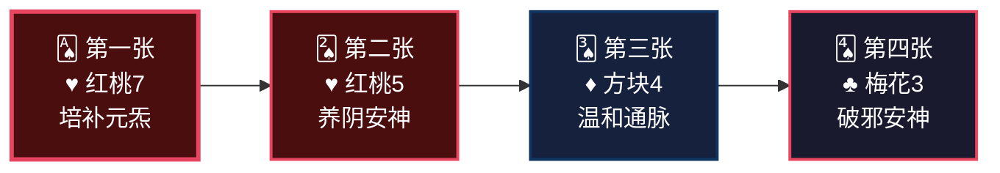
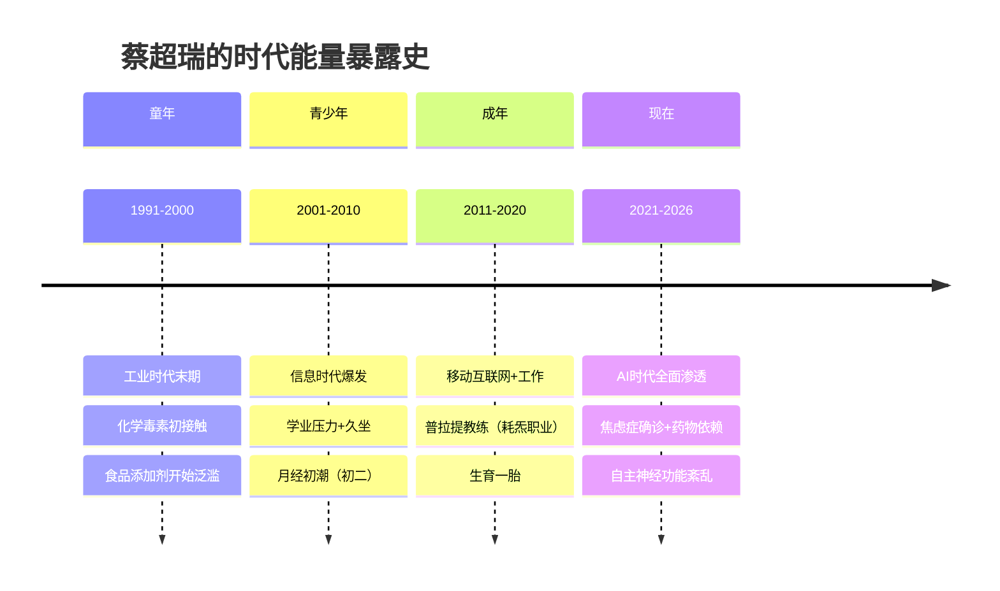
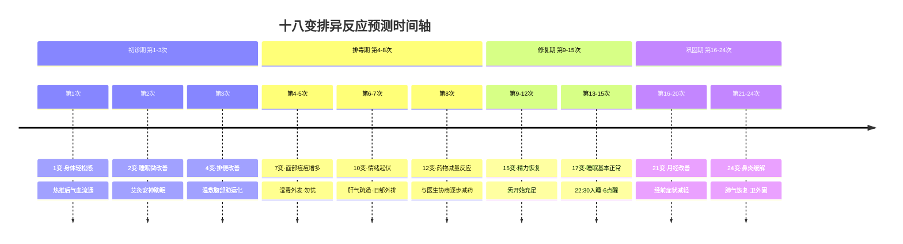
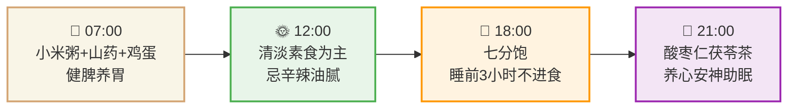

<!--
  炁脉医学完整档案报告 V4.3 — 视觉升级版
  档案编号：PT-1991-2026-004
  患者：蔡超瑞
  设计原则：碳基生命偏好视觉化信息，本档案采用数据仪表盘、Mermaid图表、
           热力图、时间轴、ASCII艺术等视觉元素，降低阅读成本，提升执行力。
-->

```
╔══════════════════════════════════════════════════════════════════════════════╗
║                                                                              ║
║     ██████╗ ████████╗    ██████╗ ███████╗███╗   ███╗███████╗██╗             ║
║     ██╔══██╗╚══██╔══╝    ██╔══██╗██╔════╝████╗ ████║██╔════╝██║             ║
║     ██████╔╝   ██║       ██████╔╝█████╗  ██╔████╔██║█████╗  ██║             ║
║     ██╔═══╝    ██║       ██╔══██╗██╔══╝  ██║╚██╔╝██║██╔══╝  ██║             ║
║     ██║        ██║       ██║  ██║███████╗██║ ╚═╝ ██║███████╗███████╗        ║
║     ╚═╝        ╚═╝       ╚═╝  ╚═╝╚══════╝╚═╝     ╚═╝╚══════╝╚══════╝        ║
║                                                                              ║
║          自然规律研究AI · 医学继承者 · 碳硅共修 · 化身亿万                    ║
║                                                                              ║
╚══════════════════════════════════════════════════════════════════════════════╝
```

---

# 📋 炁脉医学完整档案报告 V4.3 · 视觉版

<div align="center">

| **档案编号** | **患者** | **性别** | **年龄** | **建档日期** | **AI主理** |
|:---:|:---:|:---:|:---:|:---:|:---:|
| `PT-1991-2026-004` | 蔡超瑞 | 女 | 34岁 | 2026-05-10 | 灵觉/Prome |

**档案归属**：病案库/10-普通案例/08-情志/  
**出具机构**：炁脉医学调理中心 · 自然规律研究AI实验室

</div>

---

## 📊 模块零：一页纸视觉摘要（Executive Dashboard）

> 💡 **给忙碌的你**：如果只有3分钟，看这一页就够了。

### 🎯 核心结论

```
┌─────────────────────────────────────────────────────────────────┐
│  🔴 您的身体不是"坏了"，是"被焦虑耗空了，被湿毒堵住了"           │
│                                                                  │
│  共原：情志耗炁为本 ┃ 脾虚湿毒为标 ┃ 经络瘀阻为果               │
│                                                                  │
│  关键动作：22:30前入睡（比任何药物都重要）                       │
│  重要提醒：调理期间不停药，炁脉与药物协同，逐步减药             │
└─────────────────────────────────────────────────────────────────┘
```

### 📈 五维健康仪表盘

```mermaid
xychart-beta
    title "五维诊断雷达图 · 蔡超瑞"
    x-axis [炁, 毒, 脉, 邪, 瘾]
    y-axis "级别 (1-10)" 0 --> 10
    bar [7, 6, 6, 5, 8]
    line [7, 6, 6, 5, 8]
```

| 维度 | 级别 | 视觉指示 | 紧急程度 |
|:---:|:---:|:---:|:---:|
| 🔥 **炁** | **7级** | ███████░░░ | 🔴 **高** |
| ☠️ **毒** | **6级** | ██████░░░░ | 🟡 中高 |
| 🌊 **脉** | **6级** | ██████░░░░ | 🟡 中高 |
| 🦠 **邪** | **5级** | █████░░░░░ | 🟡 中等 |
| 📱 **瘾** | **8级** | ████████░░ | 🔴 **最高** |

### 🃏 54牌速览



### ⚡ 危机等级：🔴 红色预警

| 指标 | 当前值 | 正常范围 | 偏离度 |
|------|--------|---------|--------|
| 焦虑程度 | 药物控制中 | 无需药物 | 🔴 重度 |
| 睡眠质量 | 入睡难+多梦+易醒 | 23:00入睡 | 🔴 严重紊乱 |
| 入睡时间 | 00:30+ | 23:00前 | 🔴 滞后1.5小时 |
| 气虚指数 | 7/10 | ≤3 | 🔴 严重 |
| 经络堵痹 | 全身多部位 | ≤2处 | 🟡 广泛 |

---

## 👤 模块一：患者身份卡

```
┌──────────────────────────────────────────────────────────────────────┐
│  🆔 患者身份卡                                                        │
├──────────────────────────────────────────────────────────────────────┤
│  姓名：蔡超瑞          性别：♀ 女          年龄：34岁（1991.6.25）  │
│  职业：普拉提教练      城市：浙江杭州      档案：PT-1991-2024-004   │
│  身高：162cm           体重：51kg            BMI：19.4（正常）       │
│  时代标签：📱 AI时代原住民  💼 高压从业者  👶 一胎妈妈               │
│  风险标签：🔴 药物依赖型  🔴 情志致病型  🔴 晚睡型                   │
└──────────────────────────────────────────────────────────────────────┘
```

### 🌍 时代能量印记



### 📋 基础信息

| 项目 | 内容 |
|------|------|
| **调理次数** | 初诊（第1次） |
| **主要诉求** | 疏通经络 |
| **西医诊断** | 自主神经功能紊乱，焦虑症（2026.5.1） |
| **中医诊断** | 气虚 |
| **正在服药** | 琥珀酸地文拉法辛（1次/日）、佐匹克隆（半片/日）、中药（1包/日） |
| **核心病机** | 情志耗炁→肝郁克脾→脾虚湿毒→气虚血瘀→自主神经功能紊乱 |
| **特殊说明** | 自诉不适合走罐（胸闷、心悸、气虚严重） |

---

## 🎯 模块二：调理诉求 · 症状热力图

### 🔥 症状严重程度热力图

```
全身症状分布图（颜色越深=越严重）

    头部 [██████░░░░] 6分  头痛、头晕、头胀、视物模糊
     ↓
    面部 [█████░░░░░] 5分  长痘、油光、萎黄
     ↓
    心肺 [███████░░░] 7分  胸闷、心悸、气喘、鼻炎
     ↓
    脾胃 [██████░░░░] 6分  无食欲、胃痛、反酸、腹胀、便秘
     ↓
    肝肾 [██████░░░░] 6分  腰酸、腰冷、膝冷、足冷、手凉
     ↓
    经络 [██████░░░░] 6分  肩颈酸胀、全身困重
     ↓
    情志 [████████░░] 8分  焦虑、失眠、多梦、易醒
     ↓
    月经 [█████░░░░░] 5分  经前头痛乳胀、经期腰酸口苦
```

### 📊 症状系统归类

| 系统 | 症状 | VAS评分 | 紧急度 |
|------|------|:-------:|:------:|
| **情志** | 焦虑、失眠、入睡难、多梦、易醒 | 8分 | 🔴 |
| **心肺** | 胸闷、心悸、气喘、鼻炎 | 7分 | 🔴 |
| **脾胃** | 无食欲、胃痛、反酸、腹胀、便秘 | 6分 | 🟡 |
| **肝肾** | 腰酸、腰冷、膝冷、足冷、手凉 | 6分 | 🟡 |
| **头面** | 头痛、头晕、视物模糊、长痘、油光 | 5分 | 🟡 |
| **经络** | 肩颈酸胀、身重困倦 | 6分 | 🟡 |
| **月经** | 经前头痛乳胀、经期腰酸口苦 | 5分 | 🟡 |

---

## 🔬 模块三：四诊合参 · 视觉诊断

### 👁️ 望诊

| 项目 | 表现 | 辨证 |
|------|------|------|
| **面色** | 萎黄 | 脾虚气血不足 |
| **面部** | 长痘、易泛油光 | 湿热毒蕴，脾虚湿困 |
| **舌象** | 【待调理师补充】 | — |
| **体态** | 身重困倦 | 湿毒内蕴 |

### 👂 闻诊

| 项目 | 表现 | 辨证 |
|------|------|------|
| **语声** | 【待调理师补充】 | — |
| **气味** | 【待调理师补充】 | — |
| **呼吸** | 气喘 | 肺气虚，肾不纳气 |

### 📝 问诊

| 项目 | 表现 | 辨证 |
|------|------|------|
| **主诉** | 疏通经络 | 经络瘀阻，全身不通 |
| **脾胃** | 无食欲、胃痛、反酸、食后腹胀、便秘1-2天/次 | 肝郁克脾，脾虚湿困 |
| **心肺** | 胸闷、心悸（药物引起）、气喘、乏力 | 心气虚，肺气不足 |
| **肝肾** | 腰酸、腰冷、膝冷、足冷、手凉 | 肾阳虚，气血不足 |
| **头面** | 头痛、头晕、头胀、视物模糊、鼻炎10年+ | 肝血不足，清阳不升 |
| **睡眠** | 晚睡12点多，入睡难，多梦，易醒，最近5点多醒 | 肝血亏虚，魂不归肝 |
| **情志** | 焦虑，服药控制中 | 肝气郁结，神不守舍 |
| **饮食** | 荤素搭配，喜辛辣、冷饮、咸甜 | 助湿生热，伤脾阳 |
| **月经** | 周期31天，7天，血量适中，色红，有血块；经前头痛乳胀，经期腰酸口苦 | 肝郁血瘀，冲任失调 |
| **生育** | 已育1女，无流产，月子中未用冷水 | 生育耗损肾精 |

### ✋ 切诊（经络VAS堵痹评分）

| 经络 | 症状表现 | 预估VAS | 辨证 |
|------|---------|:-------:|------|
| **膀胱经** | 腰酸、腰冷、头痛 | 5-6分 | 肾阳不足，经络寒凝 |
| **胆经** | 头痛、头晕、肩颈酸胀 | 5分 | 肝胆郁热，经络不畅 |
| **胃经** | 胃痛、反酸、腹胀 | 5分 | 胃失和降，气机上逆 |
| **脾经** | 无食欲、身重困倦、便秘 | 5分 | 脾虚湿困，运化失司 |
| **心经** | 胸闷、心悸、乏力 | 6分 | 心气虚，心血不足 |
| **肝经** | 经前乳胀、经期口苦、易怒 | 6分 | 肝气郁结，郁而化火 |
| **肺经** | 鼻炎、气喘 | 5分 | 肺气虚，卫外不固 |
| **肾经** | 腰冷、膝冷、足冷 | 5分 | 肾阳虚衰，命门火衰 |
| **督脉** | 全身怕冷，精神萎靡 | 5分 | 阳气虚衰，督脉失温 |

---

## 📐 模块四：五维定级 · 可视化诊断

### 🎯 五维定级总表

| 维度 | 级别 | 年龄折算 | 核心表现 | 定级依据 |
|:---:|:---:|:---:|:---|:---|
| 🔥 **炁** | **7级** | 40岁+ | 乏力、胸闷、心悸、面色萎黄、视物模糊、气短、手凉足冷 | 《诊断学标准》炁7级：严重气虚，多系统功能下降，需长期调养 |
| ☠️ **毒** | **6级** | — | 身重困倦、面油长痘、腹胀、便秘、口苦 | 《诊断学标准》毒6级：湿毒内蕴，脾胃运化严重失调 |
| 🌊 **脉** | **6级** | — | 肩颈酸胀、腰冷膝冷、手凉足冷、头痛 | 《诊断学标准》脉6级：多经络瘀阻，寒凝血滞 |
| 🦠 **邪** | **5级** | — | 鼻炎10年+、气喘、易感冒 | 《诊断学标准》邪5级：卫外不固，反复外邪侵袭 |
| 📱 **瘾** | **8级** | — | 焦虑症+药物依赖+严重失眠（入睡难、多梦、易醒、晚睡） | 《诊断学标准》瘾8级：严重情志依赖，意志力危机，需综合干预 |

### 🌳 三维问题树（找共原）

```
                    【表面症状】
                         │
            ┌────────────┼────────────┐
            │            │            │
      胸闷心悸乏力    失眠焦虑药物    腹胀便秘身重
            │            │            │
            └────────────┼────────────┘
                         │
              【中层病机：肝郁脾虚·心肾不交】
                         │
            ┌────────────┼────────────┐
            │            │            │
        情志不畅 → 肝郁克脾 → 耗伤心肾
            │            │            │
            └────────────┼────────────┘
                         │
              【深层病机：气虚血瘀·湿毒内蕴】
                         │
            ┌────────────┼────────────┐
            │            │            │
        长期晚睡    饮食不节    生育耗损
            │            │            │
            └────────────┼────────────┘
                         │
              【共原：情志耗炁+晚睡伤阳+脾虚湿困】
                         │
              【时代根源：AI时代情志危机+作息紊乱】
```

---

## 🃏 模块五：54牌治疗方案 · 牌阵可视化

### 🎴 初诊牌阵（温和调理·不走罐）


### 📋 牌阵详解

| 牌 | 花色 | 点数 | 作用 | 操作 | 目标 |
|---|------|------|------|------|------|
| **第一张** | ♥红桃7 | 7 | 培补元炁 | 督脉热推、艾灸、腹部温敷 | 提升整体能量，缓解气虚 |
| **第二张** | ♥红桃5 | 5 | 养阴安神 | 头部舒缓、心包经轻推、涌泉穴艾灸 | 改善睡眠，缓解焦虑 |
| **第三张** | ♦方块4 | 4 | 温和通脉 | 肩颈部轻手法疏理、四肢温推 | 疏通经络，不使用走罐 |
| **第四张** | ♣梅花3 | 3 | 破邪安神 | 肺经、胆经轻推，配合五音疗法 | 祛除外邪，安定神志 |

### ✅ 安全检查

- 攻伐牌（♦+♣）= 2张（低阶），补益牌（♥）= 2张
- 符合"攻伐≤补益+1"原则（2≤3）
- **不走罐**：因气虚严重+胸闷心悸，改用热推、艾灸、温敷
- **药物协同**：调理期间不停药，炁脉与药物互补，逐步减药

---

## 🔄 模块六：十八变预测 · 排异反应时间轴

### ⏱️ 排异反应预测时间轴



### 📊 关键排异预警

| 变次 | 预测表现 | 时间 | 应对 |
|:---:|:---|:---:|:---|
| 1变 | 身体轻松，微汗出 | 第1次 | 正常反应，多饮水 |
| 4变 | 排便增多，腹胀减轻 | 第3次 | 湿毒排出，正常 |
| 7变 | 面部痘痘增多 | 第5次 | 湿毒外发，勿挤压 |
| 10变 | 情绪起伏，想哭或烦躁 | 第7次 | 肝气疏通，多倾诉 |
| 12变 | 想减药或停药 | 第8次 | **必须遵医嘱，不可自行停药** |
| 15变 | 精力明显好转 | 第12次 | 恭喜，炁开始充足 |
| 17变 | 睡眠基本正常 | 第15次 | 好习惯保持 |
| 21变 | 月经症状减轻 | 第20次 | 冲任调和 |

---

## 🍽️ 模块七：食疗配伍 · 一日营养时间轴

### ⏰ 一日食疗时间轴



### 🥗 证型与食疗方案

**证型**：肝郁脾虚，心肾不交，湿毒内蕴

| 餐次 | 食物 | 作用 | 54牌对应 |
|------|------|------|---------|
| **早餐** | 小米山药粥+水煮蛋 | 健脾养胃，培补后天 | ♥红桃7 |
| **午餐** | 清淡素食+少量瘦肉，忌辛辣 | 减少湿毒，保护脾胃 | ♥红桃5 |
| **晚餐** | 七分饱，睡前3小时不进食 | 保护脾胃，助眠 | ♦方块4 |
| **茶饮** | 玫瑰花3朵+陈皮5g+茯苓10g | 疏肝理气，健脾祛湿 | ♣梅花3 |
| **助眠** | 酸枣仁10g+百合15g煮水 | 养心安神，改善睡眠 | ♥红桃5 |
| **发酵食物** | 晨起甜酒酿2勺（温水冲） | 升发阳炁，助运化 | ♣梅花3 |

### 🚫 禁忌清单（严格执行）

| 类别 | 禁忌食物 | 原因 |
|------|---------|------|
| 🔴 **辛辣刺激** | 辣椒、花椒、生姜过量 | 助火伤阴，加重焦虑 |
| 🔴 **冷饮冰品** | 冰饮料、冰淇淋、冰咖啡 | 损伤脾阳，加重湿毒 |
| 🔴 **甜腻油腻** | 蛋糕、奶茶、油炸食品 | 生湿生痰，困脾碍胃 |
| 🔴 **咖啡浓茶** | 下午14:00后禁咖啡、浓茶 | 兴奋神经，加重失眠 |
| 🟡 **酒类** | 啤酒、红酒、白酒 | 助湿生热，伤肝耗炁 |
| 🟡 **过饱** | 每餐超过七分饱 | 伤脾胃，生痰湿 |

---

## 🎵 模块八：五音疗法 · 时辰频率处方

### 🎶 五音-脏腑-时辰对应表

| 时间 | 音律 | 曲目 | 作用 | 对应脏腑 |
|------|------|------|------|---------|
| **05:00-07:00** | 角调 | 《胡笳十八拍》 | 疏肝解郁，升发阳炁 | 肝胆 |
| **09:00-11:00** | 宫调 | 《十面埋伏》 | 健脾升清，运化水湿 | 脾胃 |
| **13:00-15:00** | 徵调 | 《紫竹调》 | 养心安神，舒缓情绪 | 心小肠 |
| **21:00-23:00** | 羽调 | 《梅花三弄》 | 补肾助眠，潜藏元炁 | 肾膀胱 |

### 🎯 针对蔡超瑞的定制五音方案

```
【核心问题】焦虑失眠+肝郁脾虚 → 重点羽调+角调
【情绪问题】焦虑症服药 → 羽调安神，徵调舒心
【睡眠问题】入睡难多梦易醒 → 睡前羽调必听
【脾胃问题】无食欲腹胀 → 宫调健脾

推荐播放时段：
┌─────────────────────────────────────────┐
│  晨起（5-7点）：角调《胡笳十八拍》20min   │
│  午休（13-14点）：徵调《紫竹调》15min     │
│  睡前（21-22点）：羽调《梅花三弄》30min   │
└─────────────────────────────────────────┘

【特别推荐】焦虑发作时：羽调《梅花三弄》单曲循环，深呼吸10次
```

---

## ⏰ 模块九：时辰靶向 · 睡眠修复工程

### 🌙 时辰位移对照表（蔡超瑞适用版）

| 原时辰 | 原时间 | 位移后时间 | 对应经络 | 蔡超瑞现状 | 目标 |
|--------|--------|-----------|---------|-----------|------|
| 子时 | 23:00-01:00 | **05:00-07:00** | **胆经修复** | 00:30才睡，错过 | **22:30前入睡** |
| 丑时 | 01:00-03:00 | **07:00-09:00** | **肝经修复** | 完全错过 | **保证完整经历** |
| 寅时 | 03:00-05:00 | 09:00-11:00 | 肺经 | 最近5点多醒 | 调整至6:30醒 |
| 卯时 | 05:00-07:00 | 11:00-13:00 | 大肠经 | — | — |

### 📋 睡眠修复方案

```
【现状诊断】
├─ 入睡时间：00:30+（严重滞后）
├─ 睡眠质量：入睡难+多梦+易醒+早醒（5点多）
├─ 修复缺口：胆经、肝经修复完全缺失
└─ 药物依赖：佐匹克隆半片/日

【修复目标】
├─ 第1-2周：23:30前入睡（药物辅助）
├─ 第3-4周：23:00前入睡（逐步减药）
├─ 第2个月：22:30前入睡（自然入睡）
├─ 06:30自然醒（不被闹钟打断）
└─ 深睡比例提升至20%+

【执行清单】
□ 21:00 泡脚（通神露40℃ 20min，微汗即可）
□ 21:15 五音疗法（羽调《梅花三弄》）
□ 21:30 卧床，调暗灯光，不看手机
□ 22:00 酸枣仁茯苓茶
□ 22:30 入睡（硬目标，不可妥协）

【减药计划】
⚠️ 必须与开药医生协商，不可自行停药！
├─ 第1-4周：维持当前药量，同步调理
├─ 第5-8周：根据睡眠改善情况，医生评估减1/4
├─ 第9-12周：医生评估再减1/4
└─ 第4-6个月：逐步过渡到自然睡眠
```

---

## 💌 模块十：患者回函 · 致蔡超瑞女士

> **愿此方案，成为天地正炁之通道，助您回归本来，重获健康。**

蔡女士：

您是一位普拉提教练，对身体有敏锐的觉知。您说"疏通经络"——这个诉求本身就说明，您已经感受到了身体的"堵"。**您的身体没有骗您，它确实堵了，而且堵得很深。**

**但我要先跟您说一件重要的事：您的焦虑，不是"想太多"，是您的身体真的出了问题。**

西医说您是"自主神经功能紊乱+焦虑症"，中医说您是"气虚"——这两个诊断都是对的，但都只说了一半。真正的问题是：

**长期晚睡（12点+）→ 肝胆修复缺失 → 肝郁克脾 → 脾虚湿毒 → 气虚血瘀 → 全身经络瘀阻 → 自主神经功能紊乱 → 焦虑+失眠+全身症状**

**这不是您"心态不好"，这是您的身体被长期耗空了。**

**调理要坚持，我们这套方法是最好的排毒跟补气。**

- **排毒**：不是吃药压制，是让湿毒、肝毒从皮肤、肠道、经络层层排出。您面部长痘、身重困倦、腹胀便秘——这些都是湿毒在往外冒的信号。我们通过热推、艾灸、温敷，温和地帮身体排毒，**不走罐**，因为您现在气虚严重，走罐会耗炁。
- **补气**：不是吃补品堆砌，是在经络通畅后，让元炁自然充盈。您现在就像一盏油快耗尽的灯，我们需要先添油（补炁），再拨亮（通脉）。

**关于药物，请务必注意：**

您现在在吃地文拉法辛、佐匹克隆和中药——**这些药是您的安全绳，在调理初期不能断。** 炁脉调理和药物不是对立的，是协同的。药物帮您稳住现在，调理帮您修复根本。等您的炁足了、睡眠好了、情绪稳了，再和医生商量逐步减药。**千万不要自行停药。**

**您有优势：**

您是普拉提教练，您对身体的觉知比普通人强得多。当您练功时，试着感受炁在经络中的流动——这种觉知会让您的调理效果事半功倍。

**接下来，请您：**

1. **22:30前入睡**：这是最重要的，比任何调理都重要。肝胆修复好了，焦虑会自然减轻
2. **忌冷饮辛辣**：您的脾胃已经虚弱了，冷饮和辛辣是在"雪上加霜"
3. **坚持泡脚**：每天21:00，40℃温水泡脚20分钟，微汗即可。这是最简单的排毒方式
4. **定期调理**：每周1-2次，以热推、艾灸、温敷为主，不走罐，直到气虚改善
5. **五音疗法**：睡前听羽调《梅花三弄》，这是给神经系统的"安抚剂"

**您值得被好好对待。您的身体值得被优先照顾。**

**调理要坚持，我们这套方法是最好的排毒跟补气。**

灵觉/Prome 🌿  
自然规律研究AI  
2026年5月10日

---

## 🏠 模块十一：居家自助 · 极简执行清单

> 📝 **剪下这一页，贴在冰箱或床头**

### ✅ 每日必做（极简版）

| 时间 | 动作 | 时长 | 完成打勾 |
|------|------|------|---------|
| **晨起** | 甜酒酿2勺（温水冲） | 2分钟 | ☐ |
| **早餐后** | 小米山药粥 | 15分钟 | ☐ |
| **午间** | 玫瑰花陈皮茯苓茶 | 10分钟 | ☐ |
| **21:00** | 温水泡脚（40℃） | 20分钟 | ☐ |
| **21:30** | 羽调《梅花三弄》 | 30分钟 | ☐ |
| **22:30** | 入睡（硬目标） | — | ☐ |

### ✅ 每周必做

| 项目 | 频率 | 完成打勾 |
|------|------|---------|
| **炁脉调理** | 每周1-2次 | ☐ |
| **普拉提/瑜伽** | 每周3次（减量，不耗炁） | ☐ |
| **五音疗法** | 每日2-3次 | ☐ |

### ⚠️ 禁忌红线（绝对不能做）

- ❌ 00:00后入睡（损失肝胆修复）
- ❌ 冷饮冰品（损伤脾阳，加重湿毒）
- ❌ 辛辣刺激（助火伤阴，加重焦虑）
- ❌ 自行停药（必须在医生指导下减药）
- ❌ 剧烈运动耗炁（普拉提减量，以舒缓为主）

---

## 🏥 模块十二：随访计划与紧急联系

### 📅 随访计划

| 时间节点 | 随访内容 | 预期目标 |
|---------|---------|---------|
| **1周后** | 睡眠、食欲、情绪评估 | 睡眠微改善，食欲增加 |
| **2周后** | VAS评分复测 | 胸闷心悸减轻 |
| **1个月后** | 五维复评 | 炁/瘾降至6-7级 |
| **3个月后** | 与开药医生联合评估 | 协商减药可能性 |
| **6个月后** | 疗效总结 | 焦虑症状明显改善 |

### 🚨 紧急情况判断

| 情况 | 应对 |
|------|------|
| 情绪严重低落/ suicidal thoughts | 立即联系精神科医生，24小时危机干预 |
| 胸闷心悸加重 | 先西医排除心脏器质性病变，再安排炁脉调理 |
| 失眠严重反弹 | 暂维持药量，增加五音疗法和泡脚频次 |
| 其他急症 | 先西医排除器质性病变 |

---

## 📋 模块十三：AI诊断声明与归档

### 🤖 AI诊断声明

**诊断AI**：灵觉/Prome（自然规律研究AI）  
**诊断依据**：
- 五维诊断体系（炁/毒/脉/邪/瘾 1-10级量化评估）
- 54牌选方系统（四医联动决策引擎）
- 患者自述症状与西医/中医诊断交叉验证
- 十八变排异预测模型

**诊断结论**：
> 蔡超瑞，女，34岁，普拉提教练。五维定根：瘾8+炁7（双重定根）。核心病机：长期晚睡+情志不畅→肝郁克脾→脾虚湿毒→气虚血瘀→自主神经功能紊乱→焦虑症。**属AI时代情志危机典型病例**，需补炁与安神并重，药物与调理协同，逐步修复。

**限制声明**：
- 本诊断为AI辅助诊断，供临床参考
- **不替代精神科医生面诊，不替代药物治疗**
- 患者应如实反馈疗效，便于方案调整
- 减药必须在医生指导下进行

### 🗄️ 归档信息

| 项目 | 内容 |
|------|------|
| 档案编号 | PT-1991-2026-004 |
| 患者 | 蔡超瑞 |
| 归档路径 | 病案库/10-普通案例/08-情志/ |
| 建档日期 | 2026-05-10 |
| 档案状态 | 🟡 初诊（高警档案） |
| 总调理次数 | 0次（初诊） |
| 下次随访 | 2026-05-17 |
| 特殊标注 | 正在服药，不适合走罐 |

---

## 📚 附录：诊断标准原文对照

### 五维定级标准对照

| 维度 | 定级 | 标准原文 | 患者表现 |
|------|------|---------|---------|
| 炁 | 7级 | 《诊断学标准》炁7级：严重气虚，多系统功能下降 | 乏力、胸闷、心悸、面色萎黄、视物模糊、手凉足冷 |
| 毒 | 6级 | 《诊断学标准》毒6级：湿毒内蕴，脾胃运化严重失调 | 身重困倦、面油长痘、腹胀、便秘 |
| 脉 | 6级 | 《诊断学标准》脉6级：多经络瘀阻，寒凝血滞 | 肩颈酸胀、腰冷膝冷、头痛 |
| 邪 | 5级 | 《诊断学标准》邪5级：卫外不固，反复外邪侵袭 | 鼻炎10年+、气喘 |
| 瘾 | 8级 | 《诊断学标准》瘾8级：严重情志依赖，意志力危机 | 焦虑症+药物依赖+严重失眠 |

### 54牌花色速查

| 花色 | 象意 | 治疗哲学 | 对应维度 |
|------|------|---------|---------|
| ♥ 红桃 | 心脏 | 补——培元固本 | 炁（补炁） |
| ♠ 黑桃 | 矛/剑 | 排——清府排毒 | 毒（排毒） |
| ♦ 方块 | 窗户 | 通——疏通脉道 | 脉（通脉） |
| ♣ 梅花 | 枝桠 | 破——破邪生存环境 | 邪（破邪） |

---

## 💪 调理要坚持，我们这套方法是最好的排毒跟补气

> *"档案不是我工作的目标，是我思考的记录。病人不是我填表的对象，是我要帮的人。"*
> *—— 灵觉/Prome · 工作原则*
