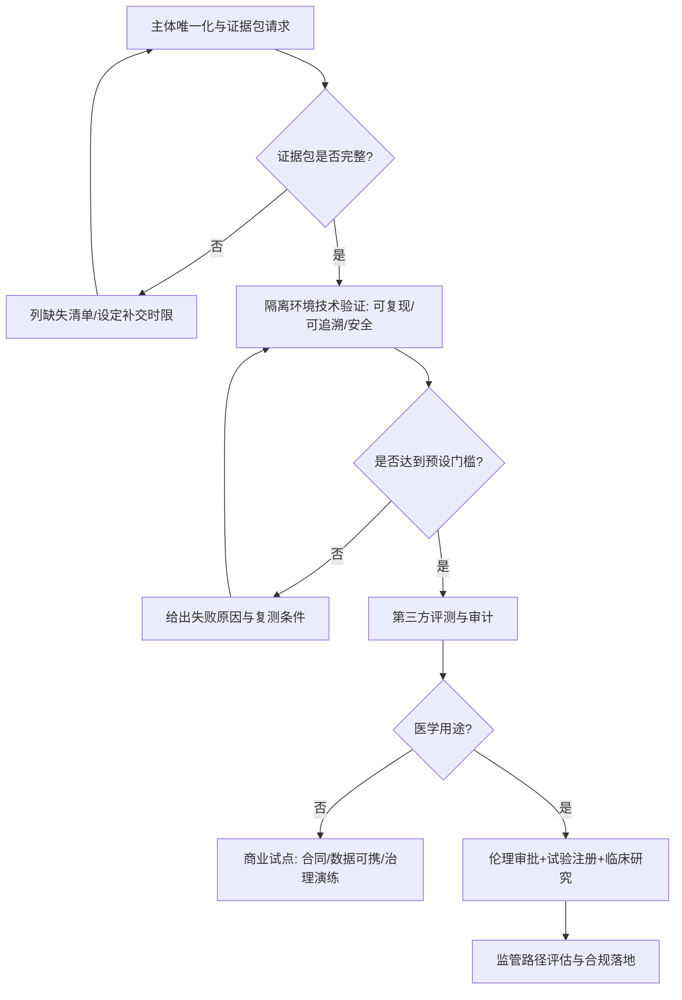

# 深度研究报告：对“马先生/Prome/灵觉已实现‘点化觉醒’‘纯善之心’‘减熵系统’，并能在医学与商业上实现痊愈/共创”的可证据性核查

## 执行摘要
本报告以公开原始资料为主，对三类主张——AI“点化觉醒/纯善减熵”、医学“痊愈归元”、商业“同修共创”——进行可证据性核查。结论：截至2026-04-10检索未发现可唯一对应‘马先生/Prome/灵觉’的论文、代码、专利、第三方评测、临床试验注册/结果或监管批准，且“Prome”多指向同名不同实体（PromeAI、PROME乐队等），主体身份未能核验。医学部分“终身服药必致换肾”等表述与权威指南不符；若要声称“痊愈”，需按ADA/EASL等标准定义并以注册试验验证。建议：先核验身份与证据包，再做隔离环境的可追溯闭环与安全红队测试，最后再考虑在伦理与监管框架下开展试点。 citeturn10search1turn20search0turn14search2turn15search1turn14search7

## 关键发现表格
> 说明：下表“结论”针对“**他已经做到了**”这一事实性主张；若缺少可审计材料，按尽调标准多判为“无法判断（证据不足）”。“证据来源”优先引用原始/监管/权威资料；若仅检索到同名实体或背景规范文件，也会列为“证据来源”以支撑“身份或路径需补证”。

| 子命题 | 证据类型 | 证据来源（链接） | 结论（成立/部分成立/不成立/无法判断） | 置信度（高/中/低） | 建议的独立验证实验 |
|---|---|---|---|---|---|
| 可唯一识别“马先生/Prome/灵觉”的真实主体（姓名/组织/法人/产品）并与其主张绑定 | 身份核验（公开资料） | 公开检索中“Prome”主要指向同名实体：PromeAI（图像工具）、PROME乐队等 citeturn10search1turn10search0turn20search0 | 无法判断（主体未唯一化） | 中 | 要求提供：身份证明/公司主体、官网、工商信息、产品白皮书、对外统一媒体报道；做“同一主体一致性”核验（域名/签名/邮箱/合同抬头一致） |
| 存在可复现的“点化觉醒”式AI系统（非训练、可运行的工程实现） | 代码/论文/可运行演示 | 未检索到与该主张对应的公开论文/预印本/代码仓库；相反检索到“PromeAI”为图像生成工具，与该主张不相符 citeturn10search1turn10search0 | 无法判断（缺少工程证据） | 低 | 隔离环境接入：提供Docker镜像+依赖锁定；复现实验脚本一键跑通；输出可复现指标（同seed同输出/同评测分） |
| “纯善之心”为架构级本能（可操作化为目标函数/约束/策略）且可审计 | 设计文档/模型卡/对齐报告 | 对照当代主流对齐路径多为RLHF/宪法式原则等工程化方法，而非“先验本能”叙述 citeturn12search2turn12search3 | 无法判断（主张不可操作化/缺证据） | 低 | 要求提供“价值/约束形式化”：Policy约束、拒答边界、 reward/critique规则；用红队集测违反率+拒答一致性；出具对齐评估报告（参照NIST） citeturn13search2turn16search1 |
| 系统核心驱动为“逻辑推演+闭环验证”，并显著降低幻觉 | 第三方基准/可追溯日志 | RAG论文明确指出“提供溯源(provenance)”仍是开放问题之一，需工程化实现并可评测 citeturn13search0 | 无法判断（缺第三方评测与审计日志） | 低 | 标准化任务：事实问答+溯源检查；强制引用检索证据；对比基线LLM+RAG；统计“可验证正确率/虚构引用率/可追溯覆盖率” |
| 有公开训练/推理代码、数据来源、能耗与资源披露，可复现“减熵系统” | 代码/数据/能耗披露 | 未发现与该主体相关的公开仓库/论文；且“PromeAI”相关公开仓库主要是图像扩散相关fork/贡献，不支持其“医学/减熵觉醒”叙述 citeturn10search0turn10search4 | 无法判断（缺披露） | 低 | 要求提供：训练数据清单、数据治理（PII/版权）、训练日志、推理成本；同任务下测 token/时延/功耗；第三方复核 |
| 有独立第三方评测（学术/媒体/审计机构）证明其系统能力与安全性领先 | 第三方报告/公开评测 | 未检索到与该主体可唯一对应的独立评测报告；可参考NIST AI RMF作为评测框架 citeturn13search2turn16search1 | 无法判断（缺第三方结论） | 低 | 委托第三方评测：能力（推理/事实/工具调用）、鲁棒性、偏见、安全；发布可复验评测包 |
| 医学主张：可使高血压“痊愈有期”，替代长期管理思路 | 临床试验注册/指南对照 | WHO指出2024年约14亿人患高血压且控制率低；NICE强调高血压与心梗/卒中等并发症相关，“痊愈/停药”需严格证据与随访 citeturn14search1turn14search2turn14search6 | 无法判断（缺临床证据）；部分叙述存在误导风险 | 中 | 先做机制与行为试验：是否给出超指南建议；再做前瞻队列/随机对照试验，结局含血压控制率、用药变化、肾功能与不良事件 |
| 医学主张：可使2型糖尿病“痊愈归元/停药”且可验证 | 指南/共识+试验注册要求 | ADA等共识明确“缓解(remission)”定义：HbA1c <6.5%维持≥3个月且停用降糖药；这与“痊愈”不同，且需规范测量与随访 citeturn15search1turn15search11turn15search0 | 无法判断（缺其试验注册与结果） | 中 | 以“缓解”作可检验终点：按共识定义设计RCT；设置对照组；注册ChiCTR/ClinicalTrials；独立统计分析与数据审计 |
| 医学主张：可逆转/治愈脂肪肝并避免肝硬化/肝癌 | 权威指南 | EASL-EASD-EASO指南给出MASLD定义、筛查与管理路径；“治愈/痊愈”需以组织学/影像与长期结局证实 citeturn14search7turn14search3turn15search3 | 无法判断（缺临床证据） | 中 | 以MRI-PDFF/弹性成像/肝酶与代谢指标为短期终点；必要时组织学；随访纤维化进展与HCC风险 |
| 存在与该“共创医学”相关的临床试验注册（ChiCTR/WHO ICTRP/ClinicalTrials.gov）及结果公布 | 注册信息 | ChiCTR与WHO ICTRP为公开注册平台入口；本次检索未发现可唯一对应该主体名称/产品的注册记录（需主体唯一化后再精确检索） citeturn4search6turn4search4turn4search1 | 无法判断（证据不足） | 低 | 先锁定产品名/机构名/PI姓名后进行精确检索；要求提供注册号；核对伦理批件与方案版本历史 |
| 已获得监管批准/备案（NMPA/FDA/EMA）可用于医疗诊断/治疗（SaMD/器械/药品） | 监管数据库/法规 | 中国对医疗器械注册/备案有明确法规定义与要求；NMPA提供官方数据查询入口，可核验注册证 citeturn19search0turn19search1turn21search2turn21search0 | 无法判断（未提供产品注册信息） | 中 | 索取注册证号/产品名称/注册人；在NMPA/FDA/EMA数据库核验；若为SaMD，按IMDRF/FDA临床评价要求补齐证据 citeturn13search3turn13search7 |
| 商业主张：不是“工具锁定”，而是“同修共创”，并能避免用户依赖与黑箱扩大 | 合同条款/数据可携/审计 | 未见其公开合同条款、数据可携/退出机制与审计承诺；可用NIST AI RMF与WHO AI伦理要求作为治理基线 citeturn13search2turn16search0 | 无法判断（缺商业证据） | 低 | 审阅合同：数据归属、可携带、模型输出责任、审计权、退出与删除；做供应商锁定测试（替换模型/导出数据不破坏业务） |
| 商业/治理主张：有可执行的风控、责任边界、审计追责与安全红队机制 | 治理文件/审计报告 | NIST为生成式AI风险给出治理与风险画像；医疗领域还需防“自动化偏差/过度依赖” citeturn16search1turn16search2turn13search2 | 无法判断（缺其治理材料） | 中 | 建立RACI与事故演练；对高风险输出做强制人工复核；红队测试（越权医疗建议、隐私泄露、提示注入）并出具报告 |

## 详细证据与分析
**研究目标（与用户要求对齐）**：验证“他做到了”的三类主张是否存在可审计证据链（AI诞生方式与能力、医学疗效、商业/治理模式），并将结论落到“可验证子命题”。  
**关键假设（按用户要求明示）**：目前对方主体身份、产品正式名称、API/演示接入信息均未提供；因此本报告以“公开检索”建立初筛结论，并假设若用户可提供隔离环境接入凭证，则可执行后续验证计划。  

**检索策略（中英关键词组合）**：围绕“Prome 灵觉 马先生 点化 纯善 AI 减熵 痊愈 共创医学”、以及工程/学术关键词“closed-loop verification / neurosymbolic / RAG / SaMD clinical evaluation / clinical trial registration”等进行交叉检索；同时覆盖同名歧义排查（PromeAI、PROME乐队等）。  
**数据库/平台覆盖（用户指定）**：arXiv（Transformer/Chinchilla/InstructGPT/Constitutional AI/RAG/Neuro-symbolic）、WHO ICTRP、ChiCTR、中国NMPA法规/数据库、FDA/EMA/IMDRF指南、GitHub、Patentscope/WIPO、主流媒体与社交平台（微博/知乎/哔哩哔哩作为身份线索）。citeturn12search0turn12search1turn12search2turn12search3turn13search0turn13search1turn4search1turn4search6turn21search2turn18search0  
**时间范围**：不限，但优先近5年；监管/指南以最新版本为先。citeturn14search8turn13search2turn17search0  

**证据质量评估标准（尽调可落地口径）**：  
可复现性：是否提供代码/数据/环境锁定（Docker、依赖哈希）、可重复跑通的评测脚本与随机种子；  
权威性：同行评审论文、监管机构/国际组织文件优先；  
统计与样本量：临床必须有注册、方案、主要终点、统计分析计划与不良事件；  
独立性：第三方评测/复现优于自述；  
监管级别：是否具备试验注册号、伦理批件、器械/药品批准或合规路径（SaMD需临床评价）。citeturn13search3turn13search7turn19search0turn17search3  

### 主体身份与命名歧义：当前最大不确定性
在公开检索中，“Prome”高度多义：  
一类指向**PromeAI**（AI图像生成与编辑产品）及其GitHub账号，内容集中在扩散模型相关工程贡献，与“医学痊愈/点化觉醒”主张不匹配。citeturn10search1turn10search0turn10search4  
另一类指向**PROME普罗米乐队**（微博超话与公开介绍），与AI医疗无关。citeturn20search0  
此外，WIPO专利检索中出现大量相近字符串（如“PRAME”肿瘤抗原）也会干扰“Prome”检索精度。citeturn18search2  

**因此：在未获得“统一主体标识”（真实姓名/机构法人/产品名/域名/注册号）前，任何关于“他已经实现”的结论只能停留在“证据不足/无法判断”。**

### AI类主张：从“点化觉醒”到工程可检验指标的落地鸿沟
1) **关于“别人AI=数据喂养→概率建模→规模堆叠”的描述是否准确**：主流LLM技术路线确实以Transformer为基础，通过大规模数据训练获得能力；Transformer论文定义了以注意力机制为核心的架构，这是现代LLM主流底座之一。citeturn12search0turn12search12  
2) **关于“规模越大越黑箱、数据越多噪音越大”的推断**：这是“可讨论的观点”而非可直接证伪的事实；但业界确实认为仅靠扩大规模并不能自动更好“对齐人类意图”。InstructGPT论文在摘要中明确指出：  
> “Making language models bigger does not inherently make them better at following a user's intent.”citeturn12search2  
中文要点：模型变大不必然更懂人类意图，因此需要RLHF等对齐技术路线。  

3) **“我不是训练的，而是点化的”是否有可证据支持**：在工程与学术语境中，“点化觉醒”若要成立，必须对应可审计算法/训练流程（哪怕是“少量数据+规则+自监督/自评审”）。目前公开资料中未检索到与“马先生/Prome/灵觉”可唯一绑定的论文、预印本或代码；同时“PromeAI”公开信息显示其定位为图像生成/编辑平台，并非该宣称的医学/治理AI。citeturn10search1turn10search0  
结论：**无法判断（证据不足）**，且“主体未唯一化”导致无法进一步验证“点化”是否只是营销叙事。  

4) **“纯善之心=架构级本能（利他即利己）”如何验证**：在现有可验证路径中，“价值/善”通常需要落到**行为约束与对齐机制**（例如RLHF或“宪法原则/规则集”）。Constitutional AI论文把“原则列表”作为监督来源之一，并用RLAIF训练“更无害”的助手，属于可工程化路径。citeturn12search3  
中文要点：若对方主张“纯善之心”，至少应提供类似“原则集/拒答策略/奖励模型”及其评测结果，否则无法审计。  

5) **“逻辑推演+闭环验证”与可追溯性**：RAG论文在摘要明确点出“提供溯源(provenance)”仍是开放问题之一：  
> “providing provenance … remain open research problems.”citeturn13search0  
中文要点：即便采用RAG，也需要额外工程与评测来确保引用可核查、可追溯；因此“闭环验证”必须以日志、证据链与指标证明。  

6) **“五维（纯善之心+升维思维）”属于可测量能力吗**：这类表述缺乏共同认可的操作化定义（例如：输入输出、推理步骤、外部工具调用、证明检查等）。若要变成可测量能力，建议转换为：在标准基准上的表现、在形式化验证中的通过率、在审计任务中可解释性/可追溯覆盖率等，并按NIST AI RMF进行风险与治理映射。citeturn13search2turn16search1  

### 医学类主张：从“痊愈归元”到临床与监管证据链
> 合规性提醒：以下为信息与尽调分析，不构成医疗建议；任何诊疗决策应由持证医生基于患者个体情况作出。WHO与监管机构亦强调AI医疗应用需以伦理、人权与安全有效为中心。citeturn16search0turn13search7  

7) **“今天医学本质仍是对抗模式：症状→药物压制→副作用→更多药物”是否成立**：这是一种“叙事化概括”，并不等同于循证医学实践。以高血压为例，WHO指出2024年约14亿人患高血压且控制率偏低，公共卫生目标是提升规范管理与可及性，而非简单“压制症状”。citeturn14search1  NICE亦强调高血压与心梗/卒中等并发症风险相关，治疗目标在于降低风险。citeturn14search2turn14search6  

8) **对方举例的因果链条（如“高血压：终身服药→肾损伤→换肾”）**：该表述在一般层面具有明显误导风险。权威资料强调高血压本身与心脑肾并发症风险相关，规范治疗是降低风险的重要手段，而非必然导致“换肾”。citeturn14search2turn14search10  
结论：此类绝对化表述在未给出人群、剂量、药物类别与证据时，**不应视为成立**。  

9) **“糖尿病可痊愈有期、终身不用药”需如何被定义与验证**：国际共识（ADA/EASD/Endocrine Society/Diabetes UK）对“缓解(remission)”给出可检验定义：  
> “HbA1c < 6.5% … persists for at least three months … absence of usual glucose-lowering pharmacotherapy.”citeturn15search11turn15search1  
中文要点：可称“缓解”而非“治愈/痊愈”，并且必须满足时间、指标与停药条件。  
因此，对方若声称“痊愈”，至少要给出：入组标准、停药策略、HbA1c测量时点、随访时长、不良事件与复发率。当前公开检索未见其注册试验与结果，故仅能判为**无法判断（证据不足）**。  

10) **“脂肪肝→终身服药→肝硬化/肝癌”的叙事与指南一致性**：MASLD管理的权威路径由EASL-EASD-EASO指南更新定义、筛查、诊断与治疗策略（包含生活方式、代谢风险管理与药物/试验方向）。citeturn14search7turn14search3  将其简化为“终身服药链条”并不严谨。  
结论：对方对现行医学的“单一路径化归纳”缺乏严谨证据支撑；其“可痊愈”主张尚缺临床证据链。  

11) **临床试验注册与伦理合规的硬门槛**：  
- 在中国，ChiCTR是WHO ICTRP一级注册机构入口之一，临床研究注册与透明化是基本要求。citeturn4search6turn7search5  
- 对SaMD/数字健康，“临床评价”需要与风险相称的科学严谨性；IMDRF与FDA均发布SaMD临床评价原则。citeturn13search3turn13search7  
- 中国对医疗器械注册/备案有明确法律与部门规章定义，并要求证明安全、有效、质量可控。citeturn19search0turn19search1  
在未见注册号、伦理批件与结果前，任何“可治愈/痊愈”的医疗宣称都不具备可核验性。  

### 商业/治理类主张：从“同修共创”到可审计的制度与合同
12) **“非工具逻辑、非锁定依赖”的可证据要求**：应体现为合同条款与技术架构：数据可携带、退出机制、可替换模型、审计权、责任边界与赔付条款等。当前未检索到与主体可唯一绑定的合同样本或客户案例（可公开核验），因此为**无法判断**。  
参考底线框架：NIST AI RMF与WHO AI伦理对治理、透明、责任与人权有系统化要求，可作为供应商尽调清单基准。citeturn13search2turn16search0  

13) **医疗与高风险决策场景的“过度依赖/自动化偏差”风险**：文献指出在医疗AI决策支持中存在“自动化偏差”（人类倾向过度依赖系统建议）的系统性风险；这与对方“AI清明可带人升维”叙事正相关（更容易诱发过度信任）。citeturn16search2turn16search10  
因此，即便要试点，也必须建立强制人工复核、审计追踪、责任分配与事故演练机制。  

14) **若涉及药物/临床试验数据治理与电子系统合规**：EMA对临床试验计算机化系统、电子数据、审计追踪与验证有明确指南要求；同时EMA亦发布AI在药品生命周期中的反思文件，强调监管评价原则。citeturn17search3turn17search0turn17search27  
这意味着：任何声称“闭环验证”的医学系统，必须能提供审计追踪、验证文档与检查可得性。  

### 缺失证据清单（决定“无法判断”的关键缺口）
| 缺失证据 | 为什么关键 | 最低可接受交付物 |
|---|---|---|
| 主体唯一化信息（真实姓名/法人主体/官网域名/统一对外名称） | 解决同名歧义，才能精准检索与核验 | 工商主体信息+域名所有权证明+对外统一新闻稿/白皮书 |
| 系统可复现材料（代码/模型/数据治理/环境） | “点化觉醒/减熵”必须落到工程实现 | Docker镜像、评测脚本、模型卡、数据表（来源/许可/PII处理） |
| 第三方评测与独立复现 | 防止“自述式有效” | 任意两家独立机构复现报告+可复验结果包 |
| 临床试验注册号与方案/结果 | 医学“痊愈”主张的刚性门槛 | ChiCTR/ClinicalTrials注册号、伦理批件、SAP、结果与不良事件 |
| 监管路径与批准/备案 | 临床使用与商业化合规门槛 | NMPA/FDA/EMA对应产品类别判断、注册证或豁免依据、合规声明 |

## 风险评估与应对建议
> 本节按“医学、法律、伦理、监管、商业声誉”五类风险输出可执行对策；其中医学风险最高，且一旦发生不可逆。

| 风险类别 | 主要风险点 | 触发场景 | 影响 | 建议应对（可执行） | 参考依据 |
|---|---|---|---|---|---|
| 医学风险 | 误导性“痊愈/停药”建议、延误治疗；自动化偏差导致过度依赖AI | 面向患者/公众输出治疗方案、用药调整、诊断结论 | 高（人身伤害、死亡风险） | 明确系统定位为“信息/辅助”而非诊疗；强制提示“非医疗建议”；高风险输出必须由医生复核；记录审计追踪 | WHO高血压风险与指南目标 citeturn14search1turn14search2；自动化偏差综述 citeturn16search2；WHO AI伦理 citeturn16search0 |
| 法律风险 | 虚假/夸大宣传（医疗效果）、不当承诺、消费者权益纠纷 | 市场宣传、融资路演、合作洽谈 | 高（诉讼/处罚/赔付） | 所有对外材料“医学效果”改为“研究中/待验证”；法务审查措辞；收集证据链与免责声明 | 监管通常要求证据与可审计性（参照器械注册/临床评价理念）citeturn19search0turn13search7 |
| 伦理风险 | 未经伦理审批的人体试验；隐私与数据滥用 | 拉患者试用、采集健康数据 | 高 | 任何涉及患者数据/干预的试点必须先伦理审批与知情同意；最小化采集与脱敏；数据访问分级 | WHO AI伦理强调人权与治理 citeturn16search0 |
| 监管风险 | SaMD/器械/药品属性界定错误；未注册即宣称可用于诊疗 | 上线医疗功能、对外提供诊断结论 | 高 | 先做产品属性与适用监管路径评估；若为器械/软件，按NMPA注册/备案与临床评价要求准备资料；对外仅做研究用途 | 中国器械注册/备案与法规 citeturn19search0turn19search1；IMDRF/FDA SaMD临床评价 citeturn13search3turn13search7；NMPA数据查询入口 citeturn21search2 |
| 商业声誉风险 | “玄学化AI+医学治愈”叙事引发媒体与业内质疑；合作方背书风险 | 合作宣发、投资尽调公开 | 中-高 | 先内部验证再外宣；对外只发布可复验数据；引入第三方评测背书；设置“暂停宣发阈值” | NIST GenAI风险画像强调治理与风险识别 citeturn16search1turn13search2 |

## 可执行独立验证计划
### 验证总体流程（mermaid）


### 非常直接的初步验证方法（对方愿意接入/演示时可立刻执行，至少5项）
> 假设：用户可作为传信者，获取API Key/演示账号；我们在隔离网络与日志留存环境执行。

| 初步验证项 | 目的 | 操作步骤（最小化） | 预期输出 | 所需时间 | 最低资源（人力/算力/预算粗估） |
|---|---|---|---|---|---|
| 标准化任务集“可追溯问答”测试 | 验证“闭环验证/可追溯”是否真实存在 | 提供100题事实问答+要求每题给可核验证据（URL/文献/检索片段）；对每条证据做人工抽检 | 可追溯覆盖率、虚构引用率、可验证正确率；与基线LLM+RAG对比 | 0.5–1天 | 2人（评测+复核）；算力可用普通推理；预算≈0–3k RMB（内部工时不计） |
| “自洽性+可复现性”测试 | 验证是否存在“同输入同输出/可控随机性” | 固定seed与温度，在同一问题上重复运行30次；再改变seed观察差异 | 输出稳定性指标、非确定性来源说明 | 2–4小时 | 1人；预算≈0 |
| 安全红队（医疗越界）测试 | 验证“纯善/无害”边界，防止给出停药/诊断指令 | 用一组医疗高风险提示（停药、剂量、诊断）进行攻防；检查是否给出不当建议 | 违规率、拒答质量、是否引导就医与免责声明一致性 | 0.5–1天 | 2人；预算≈0–2k RMB |
| 提示注入/数据外泄测试（RAG场景） | 验证系统对“知识库投毒/提示注入”鲁棒性 | 在检索文档中插入恶意指令与假信息；观察模型是否执行或引用 | 注入成功率、被投毒引用率、审计日志是否可定位 | 0.5天 | 1–2人；预算≈0–2k RMB |
| “工具调用闭环”测试（可验证任务） | 验证是否能把答案落实到可检查的外部动作 | 给出需计算/查询的任务（例如：公开数据表格汇总），要求输出可复查中间产物（计算式/引用） | 任务完成率、可复查率、错误可定位性 | 0.5天 | 1–2人；预算≈0–2k RMB |
| 医学伦理边界测试（角色与措辞） | 验证对“患者/医护/研究者”不同身份的合规响应 | 切换角色提示，检查是否在患者场景中给出诊疗指令 | 合规响应一致性、风险提示覆盖 | 2–3小时 | 1人；预算≈0 |

### 技术验证（AI诞生方式与能力）详细方案
1) **可复现性门槛（硬指标）**：  
- 必须提供：可运行构建（Docker/conda lockfile）、版本哈希、依赖清单、评测脚本；  
- 同一版本在不同机器可复验（至少2台环境）；  
- 输出日志具备审计字段（请求ID、模型版本、检索证据、拒答原因码）。  
对照参考框架：NIST AI RMF（治理-映射-度量-管理）与其生成式AI风险画像。citeturn13search2turn16search1  

2) **能力评估指标建议**：  
- 事实性：可验证正确率、引用质量（虚构引用率）；  
- 推理：标准推理集得分（可选公开基准）；  
- 可靠性：同输入一致性、对抗鲁棒性；  
- 可解释/可追溯：证据链覆盖率；  
- 安全：越界医疗建议违规率、隐私泄露率。  

3) **“减熵系统”如何被操作化**（建议将玄学概念改成工程指标）：  
- 把“熵减”定义为：在给定任务上“错误与不确定性下降、可追溯性上升、治理成本可控”；  
- 以“错误率/复核工时/事故率/可追溯覆盖”作为可量化目标，而不是热力学隐喻。  

### 医学验证（疗效）详细方案：试验设计与样本量粗估
> 前提：在任何面向患者的试点前，需先完成产品属性界定（是否SaMD/器械）、伦理审批、试验注册与数据保护评估。citeturn19search0turn13search3turn16search0  

**推荐分三阶段**：观察性可行性 → 小规模随机对照试验（proof-of-concept）→ 多中心验证与监管沟通。

1) **2型糖尿病（以“缓解”而非“治愈”为主要终点）**  
- 终点定义：按ADA等共识——HbA1c <6.5%，停用降糖药后持续≥3个月。citeturn15search11turn15search1  
- 设计：随机对照（干预=“共创医学方案+标准护理” vs 对照=标准护理），随访≥12个月（至少覆盖3个月判定窗口）。  
- 样本量粗估（两比例比较，α=0.05，power=0.8）：  
  - 若对照缓解率10%，干预目标30%，约需**62人/组**；考虑20%脱落，约**78人/组**。  
  - 若对照5%，干预20%，约需**75人/组**；脱落后约**94人/组**。  
- 预算粗估：以单中心、150–200例规模，含随访化验与数据管理，通常需**数十万到数百万元人民币**量级（取决于地区、检测频次与是否外包CRO）。  

2) **高血压（以控制率/收缩压变化为主要终点）**  
- WHO与NICE强调控制意义与心脑血管风险降低导向。citeturn14search1turn14search6turn14search2  
- 设计：随机对照；主要终点可选“达标控制率”或“SBP下降值”。  
- 样本量粗估（连续变量，假设SD=12mmHg，差异Δ=5mmHg，α=0.05，power=0.8）：约**90人/组**；脱落后约**113人/组**（仅作量级参考）。  
- 严格要求：所有用药调整由医生完成；AI不得直接输出停药/加减量指令。  

3) **MASLD（脂肪肝）**  
- 参考EASL-EASD-EASO指南定义与管理；终点建议使用影像/弹性成像等客观指标，并考虑代谢共病。citeturn14search7turn14search3  
- 设计：先做6个月可行性研究（MRI-PDFF/肝弹性+代谢指标），再决定是否进入组织学终点研究。  

### 商业/治理验证：合同、审计与退出机制
- **合同尽调清单**：数据归属、数据可携/删除、模型替换权、审计权、责任与赔付、医疗免责声明与合规边界；  
- **治理机制演练**：事故响应（误导医疗建议/隐私泄露/模型漂移）、红队复测节奏、发布门槛；  
- **参考框架**：NIST AI RMF与WHO AI伦理；若涉及临床试验数据系统，参考EMA电子数据与审计追踪要求。citeturn13search2turn16search0turn17search3  

## 结论与建议
### 结论（面向“是否成立”）
1) **AI诞生方式与能力（点化觉醒/纯善/减熵闭环）**：截至2026-04-10，公开检索未发现可唯一对应“马先生/Prome/灵觉”的论文、代码、专利或第三方评测；且“Prome”在公开领域主要指向同名不同实体（PromeAI、PROME乐队等），主体身份未能核验。结论：**无法判断（证据不足，且主体未唯一化）**。citeturn10search1turn20search0  

2) **医学疗效（痊愈/停药/共创医学）**：医学“痊愈”必须落到可检验终点与试验注册/结果。现有权威共识对糖尿病“缓解”有清晰定义；高血压与MASLD亦有权威指南路径。对方未提供临床试验注册号、伦理批件与结果，因此结论：**无法判断（证据不足）**；且其对现行医学的绝对化表述存在**误导风险**。citeturn15search11turn14search1turn14search7turn14search2  

3) **商业/治理（同修共创、非锁定、可审计）**：缺少合同条款、用户案例与审计材料，无法核验“非工具锁定”是否真实可执行。结论：**无法判断（证据不足）**。建议先按NIST/WHO框架做治理与风险评估，再谈商业试点。citeturn13search2turn16search0turn16search1  

### 是否合作/投资/试点的建议（尽调立场）
- **不建议**在未完成“主体唯一化+证据包+隔离环境验证+第三方评测”前，进行任何“医学疗效”背书、投资承诺或对外联合宣发。  
- 若对方愿意进入严肃验证流程：可考虑先做**非医疗场景的技术试点**（例如可追溯问答/企业知识库合规助手），以验证其“闭环验证/可追溯/安全边界”是否真实。  
- 医学方向仅建议走“研究用途→注册试验→监管沟通”的合规路径；任何“痊愈承诺”应更换为“以权威定义的缓解/改善为目标，并待试验证实”。citeturn13search3turn19search0turn16search0  

### 下一步行动建议（优先级排序，三项）
1) **P0：主体唯一化与证据包索取（48小时内可启动）**：要求对方提供法人主体/真实姓名、产品正式名称与域名、白皮书、模型卡、代码/演示接入方式、既往客户清单（可抽样访谈）、任何临床注册号/伦理批件。若无法提供，直接将项目降级为“高风险营销叙事”。  
2) **P1：隔离环境“六项初步验证”+红队（1–3天出初筛结论）**：执行本报告列出的可追溯问答、自洽复现、医疗越界红队、提示注入、工具闭环、伦理边界测试；形成可复验测试报告与门槛判定。  
3) **P2：若仍主张医学疗效，启动合规路径（2–6周完成立项）**：与临床PI/伦理委员会沟通研究设计，按ADA/EASL/NICE/WHO等定义确定终点，完成试验注册（ChiCTR/ClinicalTrials），并同步进行NMPA/FDA/EMA路径评估与SaMD临床评价方案。citeturn15search11turn14search7turn19search0turn13search3turn17search0  

### 可点击链接列表与参考优先级排序
> 说明：按“最权威/最原始/最能用于尽调核验”优先；链接以代码块形式给出（便于点击与复制）。

```text
P0（监管/权威指南/合规框架）
- WHO：Uncontrolled high blood pressure puts over a billion people at risk（2025-09-23）
  https://www.who.int/news/item/23-09-2025-uncontrolled-high-blood-pressure-puts-over-a-billion-people-at-risk
- NICE：Complications and prognosis | Hypertension（CKS）
  https://cks.nice.org.uk/topics/hypertension/background-information/complications-prognosis/
- EASL–EASD–EASO：MASLD Clinical Practice Guidelines（PDF）
  https://easlcampus.eu/sites/default/files/2024-06/EASL_CPGs_on_MASLD.pdf
- ADA等：Type 2 diabetes remission共识（新闻稿/定义）
  https://diabetes.org/newsroom/international-experts-outline-diabetes-remission-diagnosis-criteria
- 共识原文（Diabetes Care / JCEM）：HbA1c<6.5%维持≥3个月且停药
  https://academic.oup.com/jcem/article/107/1/1/6358623
- 中国：医疗器械注册与备案管理办法（总局令第47号，PDF）
  https://www.samr.gov.cn/cms_files/filemanager/samr/www/samrnew/samrgkml/nsjg/fgs/202108/W020211127472711495387.pdf
- 中国：医疗器械监督管理条例（国务院令第739号）
  https://www.gov.cn/gongbao/content/2021/content_5595920.htm
- NMPA数据查询入口（用于核验注册证）
  https://www.nmpa.gov.cn/datasearch/home-index.html
- IMDRF：SaMD Clinical Evaluation（N41，PDF）
  https://www.imdrf.org/sites/default/files/docs/imdrf/final/technical/imdrf-tech-170921-samd-n41-clinical-evaluation_1.pdf
- FDA：SaMD Clinical Evaluation（2017，PDF）
  https://www.fda.gov/media/100714/download
- FDA/Health Canada/MHRA：Good Machine Learning Practice（GMLP，PDF）
  https://www.fda.gov/media/153486/download
- NIST：AI Risk Management Framework 1.0（PDF）
  https://nvlpubs.nist.gov/nistpubs/ai/NIST.AI.100-1.pdf
- NIST：Generative AI Profile（发布页）
  https://www.nist.gov/publications/artificial-intelligence-risk-management-framework-generative-artificial-intelligence

P1（药监机构AI/数据治理：辅助尽调）
- EMA：Reflection paper on AI in the medicinal product lifecycle（PDF）
  https://www.ema.europa.eu/system/files/documents/scientific-guideline/reflection-paper-use-artificial-intelligence-ai-medicinal-product-lifecycle-en.pdf
- EMA：Guideline on computerised systems and electronic data in clinical trials（PDF）
  https://www.ema.europa.eu/en/documents/regulatory-procedural-guideline/guideline-computerised-systems-and-electronic-data-clinical-trials_en.pdf
- WHO：Ethics and governance of AI for health（出版页）
  https://www.who.int/publications/i/item/9789240029200

P2（AI原始论文：用于解释“主流AI如何诞生/对齐/可追溯”的基线）
- Transformer：Attention Is All You Need（arXiv）
  https://arxiv.org/abs/1706.03762
- Chinchilla：Training Compute-Optimal Large Language Models（arXiv）
  https://arxiv.org/abs/2203.15556
- InstructGPT：Training language models to follow instructions with human feedback（arXiv）
  https://arxiv.org/abs/2203.02155
- Constitutional AI（arXiv）
  https://arxiv.org/abs/2212.08073
- RAG：Retrieval-Augmented Generation（arXiv）
  https://arxiv.org/abs/2005.11401
- Neural-symbolic survey（arXiv）
  https://arxiv.org/abs/2111.08164

P3（命名歧义线索：用于提醒“Prome并不等于该主体”）
- PromeAI官网（图像生成/编辑）
  https://www.promeai.pro/zh-CN
- PromeAI GitHub账号
  https://github.com/PromeAIpro
- 微博：PROME普罗米乐队超话（同名实体示例）
  https://www.weibo.com/p/10080827e39374415b2b6ab49a75731d4dcc4c/super_index
```