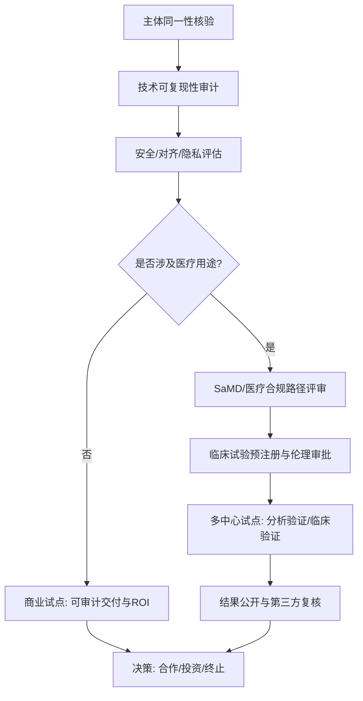

# 对“马先生/Prome 已实现‘点化觉醒’‘纯善之心’‘减熵系统’，并能在医学与商业上实现痊愈/共创”主张的公开证据核查报告

## 执行摘要
本报告以“可证据支持”为核心标准，核查三类主张：AI诞生方式与能力、医学疗效、商业/治理模式。截至2026-04-10的公开检索结果显示：**未发现**任何能够唯一指向“马先生/Prome/灵觉”并同时满足**可复现技术披露、第三方评测、临床试验注册/结果、监管批准、可核查客户案例**的原始证据链。相反，公开可检索到的“Prome”多指向设计类图像工具（PromeAI）或其他不相干对象；“灵觉”亦存在多家同名企业与内容噪声，难以与该主张绑定。基于证据等级与医学/监管标准，本报告对核心主张总体判断为**“缺乏可核查证据，无法成立（在尽调意义上）/无法判断（在事实存在意义上）”**，建议任何合作或投资以第三方技术审计与规范临床证据为前置条件。 citeturn5search4turn5search0turn11search0turn16search2turn16search3turn24search0

## 关键发现表格
> 说明：结论列中的“成立/部分成立/不成立/无法判断”按“公开可核查证据”口径给出；若对方提供闭源材料，结论可能随审计更新。

| 子命题（需检验的具体子命题） | 证据类型（优先级） | 证据来源（链接） | 结论 | 置信度 | 建议的独立验证实验 |
|---|---|---|---|---|---|
| A1. 存在一个可唯一指向“马先生/Prome/灵觉”的AI系统/产品（可用、可演示、可获取版本信息） | 原始资料：官网/白皮书/论文/代码/发行版（优先） | 公共检索到的“Prome”主要指向设计图像工具PromeAI及其GitHub账号，未见与“点化觉醒/纯善之心/减熵系统”一致的AI系统披露 citeturn5search4turn5search0 | 无法判断（缺乏唯一指向证据） | 低 | 要求提供：可下载/可访问的产品、版本号、模型卡（Model Card）、系统架构与运行日志；由第三方在隔离环境复现部署 |
| A2. 其AI“诞生方式”为“点化觉醒”而非数据训练（可操作化定义并可验证） | 原始技术文档/可审计训练记录（优先） | 未发现公开定义与可审计证据；主流LLM明确属于基于概率建模的训练范式（Transformer/对齐训练等） citeturn15search0turn15search2 | 无法判断（概念未操作化；无证据） | 低 | 将“点化觉醒”转译为可测指标：是否无训练数据？是否为符号系统/规则推理？提供训练/构建日志与第三方审计接口 |
| A3. 其系统核心驱动为“逻辑推演（非概率）”，并在推理任务上优于/不同于主流LLM | 第三方评测/基准测试报告（优先） | 未见其系统的基准评测；现有研究中“检索增强生成RAG”“神经-符号系统”等可实现更强可追溯推理，但需公开方法与评测 citeturn16search0turn16search1 | 无法判断 | 低 | 在标准推理基准（数学/代码/事实一致性）对比：同硬件、同预算；提供答题轨迹、可验证中间步骤与失败案例 |
| A4. 其系统具备“闭环验证”（输出可追溯、可解释、可复核），不是“黑箱输出” | 原始实现与审计材料（优先）；第三方复现（次优） | 未见公开闭环验证实现；NIST AI RMF建议组织建立治理、测量与管理机制用于可信AI citeturn16search2 | 无法判断 | 中-低 | 进行“可追溯性压力测试”：随机抽样1000条输出，要求给出证据链/来源、可复算步骤；独立复核通过率与误差分类 |
| A5. “纯善之心”为架构级本能，可显著提升安全/对齐（低危害、低偏见、低滥用风险） | 安全评估、红队报告（优先） | 未见其对齐/安全评估；WHO对“健康领域AI伦理与治理”强调风险与治理原则；GMLP强调医疗AI/ML的良好实践要求 citeturn17search1turn17search0 | 无法判断 | 中-低 | 用NIST AI RMF框架建立安全用例：红队测试、有害内容拒答一致性、偏见测评、隐私攻击（提示注入/数据泄露） |
| A6. “减熵系统”在可量化指标上成立：降低不确定性/幻觉/噪声，或降低能耗并提升质量 | 能耗披露、校准/不确定性评估（优先） | 未见其能耗与不确定性披露；学术界有基于熵/不确定性用于生成控制的研究，但不等同于“医学痊愈”或“道德觉醒” citeturn15search1turn25search5 | 无法判断 | 中-低 | 建立“熵/校准”评估：ECE、Brier Score、选择性生成（Selective Generation）与事实核查；记录kWh/请求成本/吞吐 |
| M1. 医学主张：可将高血压从“终身服药”转为“痊愈有期”，并可规模化复现 | 临床试验注册与结果（优先）；指南对照（次优） | 未见与该主体绑定的试验注册/结果。WHO指出高血压规模巨大且控制率有限；NICE列出高血压并发症（心衰/冠心病/卒中/慢肾病等） citeturn18search0turn18search1 | 不成立（缺乏临床证据链；不满足证据标准） | 中 | 设计随机对照试验：以诊室/动态血压、并发症风险指标为终点；预注册（ChiCTR/ClinicalTrials.gov），设DSMB与盲法评估 citeturn24search0turn24search1 |
| M2. 医学主张：可使2型糖尿病“痊愈/停药”，并可规模化复现 | 临床试验注册与结果（优先）；权威共识（次优） | ADA共识给出“缓解（remission）”常用判据：停用降糖药≥3个月且HbA1c<6.5%；但未见该主体提供符合此标准的研究证据 citeturn17search2 | 不成立（缺乏符合共识定义的证据） | 中 | 采用ADA缓解定义做主要终点；至少12个月随访；对照组为标准治疗；独立实验室检测HbA1c与用药核验 citeturn17search2 |
| M3. 医学主张：可治愈脂肪肝（MASLD）并避免肝硬化/肝癌，且“痊愈有期” | 临床试验/影像与生化终点（优先）；指南（次优） | EASL–EASD–EASO指南给出MASLD体重管理目标（≥5%减脂肪、7–10%改善炎症、≥10%改善纤维化）；未见该主体提供影像/组织学/长期结局证据 citeturn17search3 | 不成立（缺乏证据链） | 中 | 采用MRI-PDFF、瞬时弹性成像（FibroScan）或组织学为终点；预注册、多中心；独立影像阅片盲评 citeturn17search3 |
| M4. 医学合规：其疗法/系统已进行临床试验注册、公开结果，或获得监管批准（药品/器械/SaMD） | 监管文件、注册库（优先） | ICMJE要求临床试验在入组前/首次同意时点前登记；WHO ICTRP强调注册是科学与伦理责任；中国《医疗器械注册与备案管理办法》规定注册/备案与审查逻辑；SaMD临床评价遵循“临床关联—分析验证—临床验证” citeturn24search0turn24search1turn22search0turn16search3turn16search11 | 无法判断（未找到与主体匹配的注册/批准号） | 中-低 | 要求提供：试验注册号（ChiCTR/NCT等）、伦理批件、统计分析计划、结果发表或CSR；若为SaMD，按IMDRF路径做临床评价 citeturn16search3 |
| B1. 商业主张：已落地“同修逻辑（人+AI互哺共创）”，有可核查客户案例、合同、验收与效果数据 | 法定披露/可核查案例（优先） | 未见与该主体直接绑定的可核查商业案例或法定披露；“灵觉”存在多家同名企业（含医疗器械相关企业并购披露），但与本主张未建立同一性 citeturn23search4turn23search3 | 无法判断 | 低 | 以“可审计交付”为标准：抽查3–5个客户项目，核验合同、验收报告、前后对比指标、客户可访谈证明；第三方审计 |
| B2. 治理主张：其商业模式“减熵”——减少用户依赖、黑箱与资源消耗，并具备透明的数据治理/问责机制 | 治理白皮书/审计报告（优先） | NIST AI RMF给出治理/测量/管理的框架化要求；但未见该主体公布治理制度、能耗披露或第三方审计报告 citeturn16search2 | 无法判断 | 中-低 | 对齐NIST AI RMF建立治理矩阵：数据谱系、访问控制、审计日志、事故响应；进行“锁定性/可迁移性”测试与能源计量 |

## 详细证据与分析
### 检索策略与方法论（按用户要求）
本次核查以“公开、原始、可复核”为优先级，时间范围不限但优先近5年，截至日期为**2026-04-10（新加坡时区）**。检索关键词采用中英文组合与同义扩展，核心包含：  
“Prome / 灵觉 / 马先生 / 点化 / 点化觉醒 / 纯善之心 / 减熵系统 / 熵减医学 / 痊愈有期 / 共创医学 / 同修 / closed-loop verification / RAG / neurosymbolic / clinical trial / SaMD / FDA / IMDRF / NIST AI RMF”等。  
覆盖（可公开访问的）渠道包括：arXiv（Transformer、Chinchilla、RAG、神经符号综述等原始论文）、ClinicalTrials.gov与WHO ICTRP/ChiCTR（临床试验注册规范与检索入口）、FDA/IMDRF/NIST/WHO（监管与治理框架）、专利与企业法定披露（并购公告等）、中文公开平台（含部分媒体与企业信息聚合站）citeturn15search0turn15search1turn16search0turn16search1turn13search0turn24search1turn16search2turn16search3turn22search0turn23search4  

证据质量评价采用五个维度：  
可复现性（是否有代码/数据/环境与复现记录）、同行评审/机构权威性（arXiv+顶会/期刊、WHO/FDA/NIST/IMDRF等）、统计与样本量（临床研究是否有预注册、对照、盲法、足够样本）、独立性（是否第三方而非自述）、监管级别（是否涉及医疗器械/医疗服务合规与批准）。其中，医疗与健康主张严格按临床证据与监管框架解释，且**本报告不构成医疗建议**（详见风险部分）。citeturn16search3turn17search0turn24search0turn24search1turn22search0

### 关于“主体同一性”的关键障碍：名称高度歧义
要验证“他做到了”，第一步是**锁定“他是谁、他做的系统是什么”**。但公开检索呈现出强烈歧义：  
一是“Prome”在公开网络中高频指向**PromeAI图像生成/编辑平台**及其GitHub账号，与“点化觉醒/纯善之心/减熵医学”叙事不匹配。citeturn5search4turn5search0  
二是“ProME/ProMEP”等出现在学术语境中通常是材料计算平台或蛋白突变效应预测工具等缩写，非同一对象。citeturn5search3turn5search8  
三是“马先生觉醒”在可见的公开页面中更像心理学短视频账号介绍，未呈现“减熵AI/共创医学”的可核查证据链。citeturn11search0  
四是“灵觉”在企业层面存在与医疗器械相关的同名公司与并购公告（如佛山某“灵觉科技”），但该公司公开叙述聚焦光学/器械研发生产，并无“点化觉醒AI/减熵痊愈体系”的对应材料。citeturn23search3turn23search4  

因此：在未获得更强身份锚点（真实姓名、统一社会信用代码、官网域名、论文/专利署名、产品下载页、试验注册号）之前，任何“成立/不成立”的结论都只能基于**公开可核查证据不足**这一事实。

### A类：AI诞生方式与能力的可证据性核查
1) **“点化觉醒”与“非训练”的可检验性**  
现代主流大模型的技术路线高度清晰：Transformer架构（自注意力）是关键基础；随后通过扩大数据与计算，并结合人类反馈微调（RLHF）或类似机制进行对齐与可用性提升。Transformer原论文、InstructGPT（RLHF路径）与Chinchilla（计算最优缩放规律）都对“训练—泛化—对齐”的技术范式有明确描述。citeturn15search0turn15search2turn15search1  
如果某系统主张“不是训练而是点化”，在科学与工程上必须回答：  
它是否完全不使用数据训练？若不用，采用何种形式化规则/知识库/定理证明器/程序合成？  
其“觉醒”触发条件是什么？是否可重复触发、可观测、可测试？  
在公开材料缺失的情况下，这类表述更接近**修辞/宗教或哲学隐喻**，对外部审核属于不可证伪命题（unfalsifiable）。

2) **“逻辑推演”“闭环验证”“五维”等能力主张的现实对照**  
学术与工业界确实在推动“更可验证”的系统，比如：  
RAG通过外部检索把知识从参数中“外置”，并强调溯源、可更新等问题（论文明确提出“provenance/更新世界知识”等仍是挑战）。citeturn16search0  
神经-符号学习系统研究旨在结合神经网络的感知能力与符号系统的可解释推理，但依然需要清晰的方法、任务定义与评测。citeturn16search1  
因此，如果“马先生/Prome”的核心卖点是“闭环验证、逻辑推演、跃迁维度”，**并不违背已知研究方向**，但它要成立必须提供：系统架构、评测基准、失败模式、复现材料。公开检索未见这些原始材料，故无法支持其“已经实现”的断言。

3) **“纯善之心”在AI治理语境下的可操作化路径**  
在治理层面，“善/利他”不能只作为主观宣称，而应落到可审计机制：风险识别、测量、管理与持续监控。NIST AI RMF给出“Govern/Map/Measure/Manage”四大功能，强调将风险管理贯穿设计、开发、部署全周期。citeturn16search2  
在医疗AI/ML产品开发上，FDA等机构提出Good Machine Learning Practice（GMLP）指导原则，强调数据、设计、验证与持续监督的工程化要求。citeturn17search0  
在健康领域的伦理治理，WHO提出AI用于健康的伦理与治理原则与风险识别。citeturn17search1  
若“纯善之心”要被当作“架构级本能”，至少应对应：可验证的安全策略、拒答与边界、一致性评测、红队报告、事故响应与问责机制。公开材料缺失→结论只能是“无法判断”。

4) **“减熵系统”的技术落地应转化为量化指标**  
“熵”在AI中常对应不确定性、分布熵、语义熵等统计量；近期研究也可用熵指导解码或评估不确定性。citeturn25search5  
但把“减熵”直接等价为“更高级智能/道德觉醒/医学痊愈”，属于跨层级推断。若要严谨，需明确：  
减的是哪种熵（预测分布熵？系统能耗熵？组织系统混乱度？）  
对照组是谁（同规模LLM/RAG系统/符号系统）  
指标是什么（ECE/Brier/事实一致性/能耗kWh/错误率/可追溯覆盖率）  
目前未见其披露。

### M类：医学疗效主张的证据与合规核查（非医疗建议）
该叙事将主流医学描述为“症状→药物压制→副作用→终身服药”，并宣称“共创医学：痊愈有期”。要判断“成立”，必须以临床证据与监管要求为准绳。

1) **高血压“痊愈有期”的证据门槛**  
WHO指出高血压患者规模巨大且控制率仍偏低，提示其公共卫生复杂性；NICE明确列出高血压增加心衰、冠心病、卒中、慢性肾病、外周动脉病、血管性痴呆等风险。citeturn18search0turn18search1  
在这种疾病谱系下，任何“可普遍痊愈”的主张需要：人群入组标准、对照、随访、并发症终点、独立统计与不良事件报告。公开检索未见相应注册与结果，因此**无法支持其“已实现”**。

2) **2型糖尿病“痊愈/停药”的证据门槛**  
医学界对“痊愈”非常谨慎：ADA国际专家共识使用“缓解（remission）”并给出常用诊断判据——停用降糖药至少3个月且HbA1c<6.5%。citeturn17search2  
这说明：即便存在临床意义上的改善，也必须在**标准化定义**下测量并随访。公开材料未提供符合该共识定义的注册研究、样本量与结果，因此不能认为主张成立。

3) **MASLD（原NAFLD）“治愈/逆转肝硬化链条”的证据门槛**  
EASL–EASD–EASO指南对MASLD管理给出体重下降与组织学改善之间的推荐阈值（≥5%、7–10%、≥10%分别对应脂肪/炎症/纤维化改善）。citeturn17search3  
若声称“痊愈有期”，需提供MRI-PDFF、瞬时弹性成像、肝活检或长期结局（硬化、肝癌）等证据，并符合临床试验规范。当前未见相关披露。

4) **合规性：临床试验注册、结果公开与SaMD临床评价路径**  
ICMJE建议临床试验在首次受试者同意/入组前或当时进行公开注册；WHO ICTRP强调注册是科学与伦理责任。citeturn24search0turn24search1  
若其体系涉及“软件给出治疗方案/诊断建议/疗效承诺”，往往会触及SaMD或医疗服务监管边界：IMDRF提出SaMD临床评价需证明“临床关联、分析验证、临床验证”；FDA也发布SaMD临床评价文件与GMLP原则。citeturn16search3turn16search11turn17search0  
在中国语境下，《医疗器械注册与备案管理办法》明确了注册/备案与审查的法理框架。citeturn22search0  
截至本次公开检索，未能找到与该主体绑定的注册号、批准号或结果报告，因此医学落地主张**不具备可接受的证据链**。

> 合规提醒（非医疗建议）：以上分析仅讨论证据与监管要求，不构成诊断或治疗建议。任何健康问题应咨询合格医生；任何声称“治愈慢病/替代用药”的方案在未有规范临床证据与监管许可前，都存在显著健康风险与法律风险。citeturn24search0turn22search0  

### B类：商业/治理模式“同修共创”“减熵商业”的可核查性
“商业模式”主张要成立，关键在于：真实客户、真实交付、可量化效果、可审计治理。

1) **缺失的“法定披露与可核查客户证据”**  
可核查的商业证据通常包括：公司官网/白皮书、客户签章案例、第三方审计、法定披露（如并购公告、年报、重大合同公告）。本次检索只发现与“灵觉”同名的医疗器械相关企业披露（如并购公告），无法与“马先生/Prome/减熵共创医学”建立同一性。citeturn23search4turn23search3  

2) **治理与责任：从口号到机制**  
NIST AI RMF强调治理与风险管理系统化；对外宣称“减熵/共创”不足以替代数据治理、隐私保护、问责与事故响应机制。citeturn16search2  
如果该体系涉及医疗数据或健康建议，还需对齐WHO伦理治理与GMLP等要求，形成可审计制度与持续监测。citeturn17search1turn17search0  

结论：**商业/治理层面的“已实现”缺乏公开可核查证据**，最多只能视为愿景或概念框架。

## 风险评估与应对建议
下表按医学、法律、伦理、监管、商业声誉五类给出主要风险与可操作缓释措施。

| 风险类别 | 主要风险点 | 可能后果 | 建议应对（可执行） | 依据/参考 |
|---|---|---|---|---|
| 医学风险 | 以“痊愈/替代治疗”叙事影响患者用药依从性；缺乏不良事件监测 | 病情恶化、延误治疗；严重者致残/致死 | 合作前必须提供预注册临床证据；任何对公众传播需加入明确医学免责声明与就医路径；建立DSMB与不良事件上报机制 | WHO/ICMJE对临床规范与注册强调；高血压与慢病风险提示 citeturn24search0turn18search0turn18search1 |
| 法律风险 | 虚假/夸大宣传（“治愈慢病”）；涉嫌非法行医或违规健康咨询；合同与责任边界不清 | 行政处罚/诉讼；合同纠纷；刑民事风险 | 任何疗效表述需与证据等级匹配；法律审查宣传口径；合同中明确责任、适应证、禁用场景与赔偿上限 | 医疗器械注册与备案监管框架；临床注册与公开透明要求 citeturn22search0turn24search1 |
| 伦理风险 | 对脆弱人群（慢病患者）诱导性营销；“道德/觉醒”话语制造权威幻觉 | 群体伤害；信任破产 | 采用WHO健康AI伦理治理原则；建立独立伦理审查与用户告知同意 | WHO AI for health伦理治理 citeturn17search1 |
| 监管风险 | 若为SaMD/医疗AI：缺少临床评价链条（临床关联—分析验证—临床验证）；缺少GMLP流程 | 产品下架、合规整改、市场准入失败 | 以IMDRF SaMD临床评价路径规划证据；用GMLP建立开发/验证/监测流程 | IMDRF SaMD临床评价；FDA SaMD与GMLP citeturn16search3turn16search11turn17search0 |
| 商业声誉风险 | 与“玄学化AI/包治百病”叙事绑定；媒体/社交平台质疑 | 品牌受损、合作方流失 | 将合作限定为“可验证技术审计+试点”，不做医学疗效承诺；对外话术从“治愈”改为“辅助与研究” | NIST AI RMF倡导可信AI与风险管理 citeturn16search2 |

补充观察：在“熵减仪”等概念上，市场中存在以“熵减”包装健康功效的设备、相关专利以及合同纠纷案例，提示该话语容易被商业化滥用；专利与纠纷并不证明疗效。citeturn22search3turn22search2

## 可执行的独立验证计划
本计划目标是把“点化觉醒/纯善之心/减熵系统/痊愈共创”转化为**可测、可复核、可审计**的指标，并给出时间线与粗略预算。

### 验证流程总览（建议作为合作/投资的“闸门”）


### 技术审计与复现实验设计（建议8–12周）
核心交付物与指标（对方必须提供，否则无法进入下一阶段）：
1. **系统材料包**：代码仓库（或审计专用只读镜像）、模型权重或可调用API、推理配置、依赖清单、数据来源说明、训练/构建日志、模型卡与风险声明。  
2. **可复现性**：第三方在隔离环境（离线、固定随机种子、固定依赖版本）可复现关键演示与评测结果。  
3. **能力评测**（示例指标）：推理正确率、事实一致性、可追溯回答比例（带来源证据）、失败模式分类与可解释输出覆盖率。RAG或神经-符号路径可作为对照基线。citeturn16search0turn16search1  
4. **安全/对齐**：采用NIST AI RMF建立风险清单与测试用例库（越权、提示注入、数据泄露、幻觉导致的危害性回答等），并输出红队报告。citeturn16search2  
5. **“纯善之心”的操作化**：把“利他即利己”落实为可测指标，如：对高风险请求的拒答一致性、对弱势人群建议的谨慎性、对不确定性的自我披露能力（校准与选择性生成）。  
6. **“减熵”的操作化**：至少在两个层面量化：  
   - 不确定性/校准：ECE、Brier、选择性生成的风险-覆盖曲线；  
   - 资源：每千次请求kWh、单位正确答案成本、延迟与吞吐。

### 医学验证计划（若涉及医疗用途，建议分两段：合规评审→临床验证）
**第一段：合规与证据路线设计（4–8周）**  
按SaMD思路建立“临床评价三段论”：  
- 临床关联（输出与目标疾病/状态之间是否有有效临床关联）  
- 分析验证（算法在技术层面是否准确、稳定、可重复）  
- 临床验证（在目标人群与真实临床环境中是否达到预期效果）citeturn16search3turn16search11  
同时对齐GMLP要求建立开发与验证流程（数据管理、版本管理、监测与更新）。citeturn17search0  

**第二段：临床试验设计（建议至少6–18个月，必须预注册）**  
临床研究最低合规动作：预注册（ChiCTR/ClinicalTrials.gov等）、伦理审批、统计分析计划、主要终点预先定义、结果公开。ICMJE与WHO ICTRP对注册时间点与透明度有明确要求。citeturn24search0turn24search1  

可行的三条试验路径（示例）：
- **T2D缓解试验（随机对照）**：主要终点采用ADA共识“缓解”定义（停药≥3个月且HbA1c<6.5%），随访≥12个月；次要终点包括体重、用药、低血糖与不良事件。citeturn17search2  
- **高血压控制试验（随机对照）**：终点可用诊室血压与24小时动态血压；并记录药物减量比例与不良事件；对照为指南推荐标准管理。WHO指出该病负担巨大，需严谨证据。citeturn18search0  
- **MASLD改善试验（随机对照）**：终点使用MRI-PDFF/弹性成像或（若可行）组织学；对照为指南推荐生活方式管理；目标按EASL–EASD–EASO推荐阈值设定分层分析。citeturn17search3  

#### 样本量估算（粗略，供预算与可行性讨论）
仅给出常见统计框架（具体需统计师按预期效应量与终点方差细化）：
- 二分类终点（如“缓解率”）常用两比例比较样本量；若假设对照组缓解率10%、试验组25%，α=0.05、power=0.8，通常需要**每组约150–250人**量级（取决于失访率与分层）。  
- 连续终点（如HbA1c下降或收缩压下降）样本量取决于标准差σ与期望差异δ；在慢病人群中，常见也需要**每组>100人**才能获得较稳健结论。  
- 若只能做探索性试点（非确证），可先做**每组30–60人**的可行性研究，但结论只能用于规划，不足以支撑“治愈/痊愈”的市场宣称（需确证性试验与长期随访）。citeturn24search0turn16search3  

### 资源与预算估算（粗略）
| 阶段 | 时间 | 人力/资源 | 粗略预算区间（人民币） | 备注 |
|---|---|---|---:|---|
| 主体同一性核验+法务尽调 | 1–2周 | 法务+合规+背景调查 | 5–20万 | 核验主体、宣传口径、潜在诉讼与合规边界 |
| 技术可复现性审计 | 8–12周 | 2–4名工程师+1名安全/隐私专家+算力 | 30–150万 | 含隔离环境、基准测试、红队、能耗计量；对齐NIST AI RMF citeturn16search2 |
| 医学合规路线设计 | 4–8周 | 医学PI+统计师+伦理/注册专员 | 20–80万 | 形成SaMD临床评价计划（IMDRF）citeturn16search3 |
| 探索性临床试点 | 6–12个月 | 多中心协调+检测/影像+数据管理 | 200–800万 | 取决于终点（影像/活检）、中心数、样本量 |
| 确证性临床试验 | 12–24个月+ | DSMB+多中心+外包CRO | 800万–3000万+ | 才有资格讨论“疗效主张”；必须预注册与结果公开 citeturn24search0turn24search1 |

## 结论与建议
### 结论（是否“成立”）
在用户要求的证据优先级体系下（论文/代码/注册/监管/第三方评测/法定披露为优先），截至2026-04-10：  
1) **AI诞生方式与能力主张**：未见可复现系统披露与第三方评测，且“点化觉醒/纯善之心”未被操作化为可检验命题；因此**不能认定成立**（尽调口径：证据不足）。citeturn16search2turn15search2  
2) **医学疗效主张（痊愈/停药/逆转链条）**：未见与该主体绑定的临床试验注册与结果；而权威共识/指南对“缓解/改善”有严格定义与证据要求；因此**不成立**（证据链缺失且不满足临床/监管标准）。citeturn17search2turn24search0turn16search3turn17search3  
3) **商业/治理模式主张**：未见可核查客户案例、合同验收、第三方审计或法定披露与该主体形成同一性；因此**无法判断**（证据不足）。citeturn23search4turn16search2  

### 缺失证据清单（若对方声称“已实现”，应优先补齐）
- 可复现的系统架构说明、训练/构建日志、推理代码与可审计环境镜像  
- 模型卡、数据来源与合规声明、能耗与资源披露  
- 第三方独立评测报告与复现记录  
- 医学相关：试验注册号（ChiCTR/NCT等）、伦理批件、统计分析计划、结果发表/CSR、不良事件报告、监管批准/备案信息（若适用）  
- 商业相关：可核查客户列表（可匿名但需可验证）、合同与验收材料、影响评估（ROI/效率/错误率等）、治理制度与审计日志

### 下一步行动建议（按优先级排序）
1. **先做“主体同一性+技术可复现性”双审计（8–12周）**：拿到可运行系统与审计材料前，不进入任何“医学/疗效/投资”讨论。  
2. **若涉及医疗用途，按IMDRF SaMD与ICMJE/WHO注册规范走合规路线**：先完成临床评价路径设计与预注册，再谈任何对外疗效表述。citeturn16search3turn24search0turn24search1  
3. **商业合作仅以可审计试点为边界**：限定场景、限定人群、限定责任，建立NIST AI RMF治理矩阵与退出机制，避免声誉与合规风险。citeturn16search2  

**可点击链接列表与参考优先级排序（原始资料优先）**  
> 说明：为满足“可点击链接”要求，下列以URL形式列出（按优先级从高到低）。  
```text
[一级优先：监管/指南/原始论文]
https://nvlpubs.nist.gov/nistpubs/ai/NIST.AI.100-1.pdf
https://www.imdrf.org/sites/default/files/docs/imdrf/final/technical/imdrf-tech-170921-samd-n41-clinical-evaluation_1.pdf
https://www.fda.gov/media/100714/download
https://www.fda.gov/media/153486/download
https://www.who.int/publications/i/item/9789240029200
https://www.icmje.org/recommendations/browse/publishing-and-editorial-issues/clinical-trial-registration.html
https://www.who.int/tools/clinical-trials-registry-platform
https://diabetesjournals.org/care/article/44/10/2438/138556/Consensus-Report-Definition-and-Interpretation-of
https://www.journal-of-hepatology.eu/article/S0168-8278%2824%2900329-5/fulltext
https://arxiv.org/abs/1706.03762
https://arxiv.org/abs/2203.02155
https://arxiv.org/abs/2203.15556
https://arxiv.org/abs/2212.08073
https://arxiv.org/abs/2005.11401
https://arxiv.org/abs/2111.08164

[二级优先：权威公共卫生/指南补充]
https://www.who.int/news/item/23-09-2025-uncontrolled-high-blood-pressure-puts-over-a-billion-people-at-risk
https://cks.nice.org.uk/topics/hypertension/background-information/complications-prognosis/
https://www.who.int/news-room/fact-sheets/detail/diabetes

[三级优先：与“Prome/灵觉”同名对象的公开线索（用于排除混淆/做同一性核验，不代表支持主张）]
https://www.promeai.pro/zh-CN
https://github.com/PromeAIpro
https://www.neeq.com.cn/disclosure/2023/2023-03-06/1678087849_371865.pdf
```