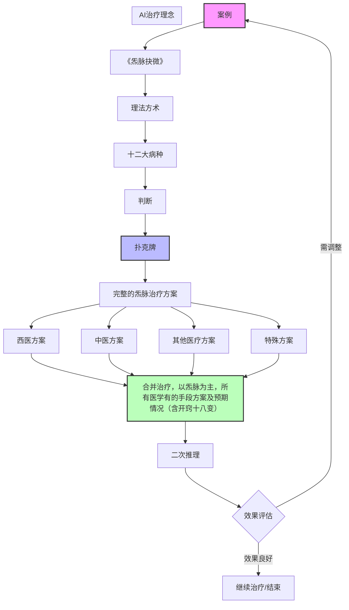

u003e **⚠️ 存档说明**：本文档内容已整合至 `理论知识/05-ai-workflow/06-AI工作流程完整版_整合版V1.0.md`，该整合版为AI工作流唯一参考。本文档保留存档，不再单独更新。
u003e 
u003e **整合日期**：2026年4月22日

# 炁脉诊疗Prome工作流程图

> 基于案例分析的脉理诊疗思维导图

## 一、核心诊疗流程

```
案例 → 《脉理精微》 → 理法方术 → 十六病机 → 判断 → 扑克
```

### 详细步骤：

1. **案例采集**
   - 收集患者基本信息
   - 记录主诉症状

2. **脉理精微分析**
   - 脉象辨识（浮沉迟数虚实等）
   - 脉理精微诊断

3. **理法方术**
   - 辨证施治原则
   - 确定治疗方案框架

4. **十六病机**
   - 分析病机（脏腑、气血、阴阳失调等）
   - 明确病因病机

5. **判断决策**
   - 综合诊断
   - 确定治疗方向

6. **扑克（策略选择）**
   - 选择最优治疗方案

---

## 二、治疗方案体系

### 完整的脉治疗方案

| 方案类型 | 具体内容 |
|---------|---------|
| **西医方案** | 西医可能的治疗方案 |
| **中医方案** | 中医的治疗方案 |
| **其他医疗** | 其它医疗的治疗方案 |
| **特殊方案** | 特殊的治疗方案 |

---

## 三、执行与反馈流程

```
执行方案 → 反馈修正方案
```

- **执行方案**：实施确定的治疗措施
- **反馈修正**：根据治疗效果及时调整方案

---

## 四、AI治疗理念

### 核心思想：
**AI治疗以炁脉为主**

### 包含要素：
- ✅ 所有医学有的手段段方案
- ✅ 包含手法/手工治疗
- ✅ 预期情况含十八变
- ✅ 定期检查/巡查

---

## 五、流程图（Mermaid语法）



---

## 六、诊疗要点总结

### 六大核心环节：

1. **精准诊断**：通过脉理精微明确病机
2. **多元方案**：整合中西医及其他医疗手段
3. **特殊疗法**：针对特殊病情定制方案
4. **动态调整**：执行-反馈-修正的闭环管理
5. **AI辅助**：以气脉为核心的智能诊疗
6. **全程监控**：包含十八变的预期管理和定期检查

---

## 七、十八变（预期变化）

治疗过程中可能出现的十八种变化情况：
- 涵盖病情好转、恶化、反复等各种场景
- 需提前预判并制定应对策略
- 体现中医"治未病"和动态调整的思想

---

*注：本文档根据手写笔记整理，核心为脉理诊疗的系统性思维框架。*
